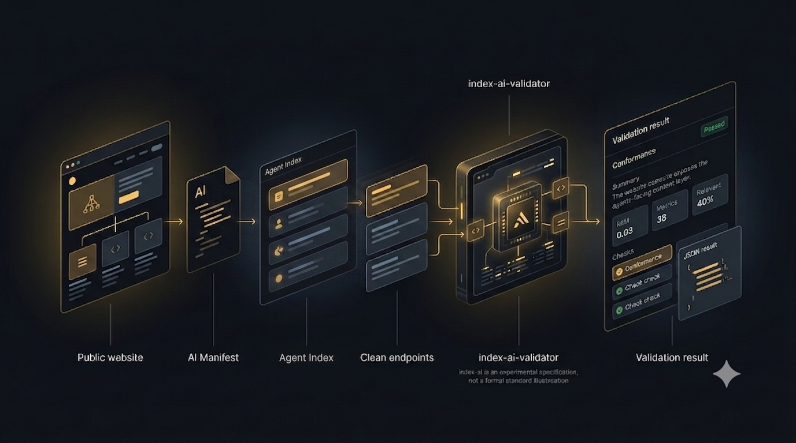

# index-ai-validator

<p align="center">
  <a href="https://www.npmjs.com/package/@hardmachinelabs/index-ai-validator">
    
  </a>
  <a href="https://www.npmjs.com/package/@hardmachinelabs/index-ai-validator">
    
  </a>
  <a href="https://github.com/jordachmakaya/index-ai-validator/actions/workflows/ci.yml">
    
  </a>
  <a href="https://github.com/jordachmakaya/index-ai-validator/blob/main/LICENSE">
    
  </a>
</p>

<p align="center">
  
  
  
  
</p>

<p align="center">
  <a href="https://jordachmakaya.github.io/index-ai-validator/">
    
  </a>
  <a href="https://github.com/jordachmakaya/index-ai-validator">
    
  </a>
</p>




**Is your website readable by AI agents?** Most sites are built for browsers, so agents have to read browser-first HTML to understand them. `@hardmachinelabs/index-ai-validator` is a free, experimental CLI that makes the agent-facing layer of a website **testable**: point it at a public URL and it checks whether the site exposes the AI Manifest, Shadow Index, and clean Markdown or plain-text endpoints an agent needs — and flags obvious leaks in that public content.

One command:

```bash
npx @hardmachinelabs/index-ai-validator https://example.com
```

It answers one practical question:

```txt
Does this public website correctly expose the current index-ai agent-facing content layer?
```

This repository contains the `@hardmachinelabs/index-ai-validator` package and its documentation.

Naming:

- `index-ai-validator` is this validator repository.
- [`index-ai`](https://github.com/jordachmakaya/index-ai) is the experimental specification being validated.
- `@hardmachinelabs/index-ai-validator` is the npm package.
- `index-ai` is also the CLI binary name.

## Validator package

Package:

```txt
@hardmachinelabs/index-ai-validator
```

The npm package is published under the HardMachine Labs scope. The CLI binary remains `index-ai`.

CLI binary:

```txt
index-ai
```

Run the CLI with:

```bash
npx @hardmachinelabs/index-ai-validator https://example.com
```

The CLI calls `validateIndexAi()`, prints a deterministic human-readable report
by default, and can print stable JSON with `--json`.

See:

- [Package README](packages/validator/README.md)
- [Documentation](docs/index.md)
- [CLI guide](docs/guide/cli.md)

## Scope

The current validator checks public `index-ai` Level 1 and Level 2a behavior:

- AI Manifest fetch, JSON parsing, content type, and schema shape
- Shadow Index fetch, graph shape, node fields, and deprecated `pages` rejection
- clean endpoint fetches through `llm_url`
- clean endpoint content type, HTML leak, and `content_chars` checks
- conservative security heuristics
- shallow discovery hints
- CLI JSON output, human output, and exit codes

It does not provide legal compliance, production certification, a security
audit, vulnerability scanning, AI traffic guarantees, SEO ranking guarantees,
Level 2b relations, or Level 3 MCP validation.
