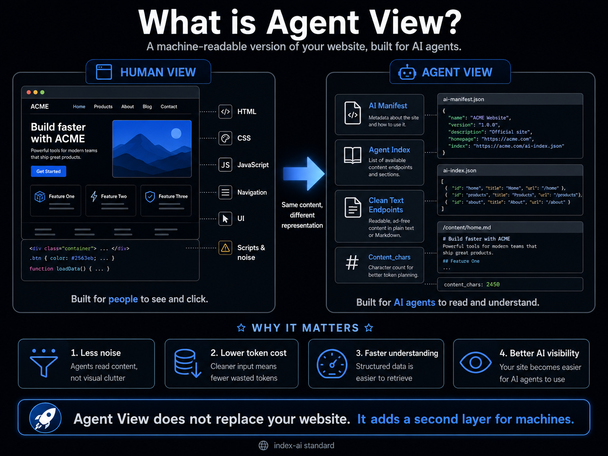
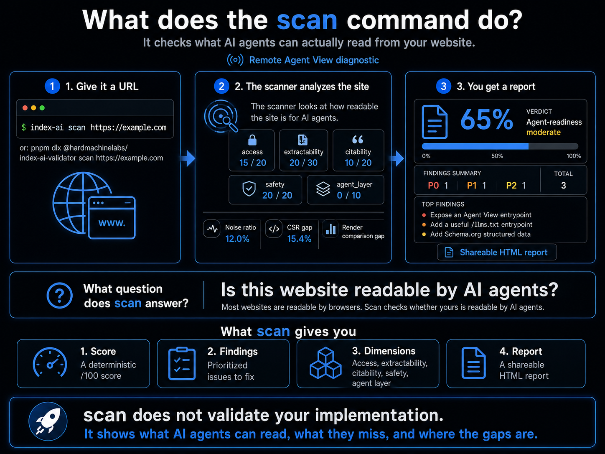
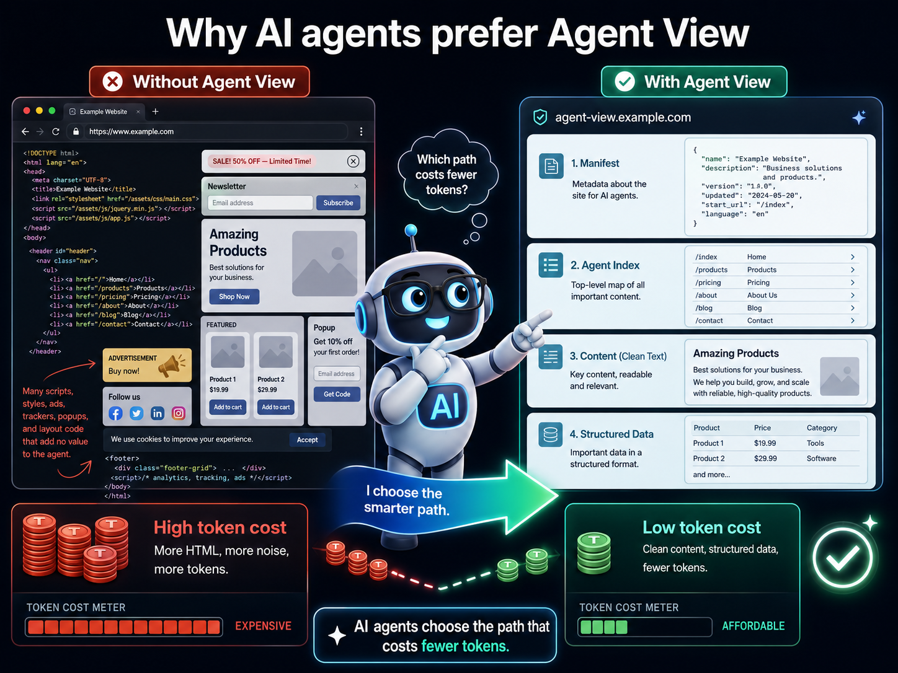

# index-ai-validator

[](https://www.npmjs.com/package/@hardmachinelabs/index-ai-validator)
[](https://www.npmjs.com/package/@hardmachinelabs/index-ai-validator)
[](https://github.com/jordachmakaya/index-ai-validator/actions/workflows/ci.yml)
[](https://github.com/jordachmakaya/index-ai-validator/blob/main/LICENSE)

[](https://github.com/jordachmakaya/index-ai-validator)
[](https://github.com/jordachmakaya/index-ai-validator)
[](https://github.com/jordachmakaya/index-ai-validator)
[](https://github.com/jordachmakaya/index-ai-validator)

[](https://jordachmakaya.github.io/index-ai-validator/)
[](packages/validator/README.md)
[](https://agent-view.com)
[](https://github.com/jordachmakaya/index-ai-validator)


## What's New in v0.2.0

This release introduces major enhancements, headlined by the new remote **`scan`** diagnostic tool:

- **`index-ai scan <url>`**: A remote diagnostic against the Agent View scanner service. It retrieves an objective agent-readiness score (`/100`), assesses key dimensions (access, extractability, citability, safety, agent layer), lists actionable findings, and generates a premium standalone HTML report.
- **Level-Aware Validation**: The local validator now supports `--target-level <l1|l2a>` to audit specific compliance targets.
- **Improved CLI UX**: Enhanced terminal output with clean headers, progress spinners, and a robust `--json` error schema.

---

`@hardmachinelabs/index-ai-validator` is a free, experimental CLI for the
`index-ai` agent-facing content layer, and it has two features that answer
two different questions:

- **Default validation mode** — is a site's already-implemented `index-ai`
  layer correct? Local, free, no dependency beyond the target site itself.
  Checks Level 1 AI Manifest and Level 2a Agent Index. There is no Level 3
  / MCP check implemented.
- **`scan`** — how AI-ready is a site overall, and what would upgrading to
  the full Agent View add? Calls the remote Agent View scanner service and
  returns an AI-readiness score, a verdict, and findings.

Most sites are built for browsers, so agents have to read browser-first
HTML to understand them. `index-ai` is a machine-readable layer built for
agents instead.



## Quick start

```bash
index-ai scan https://example.com       # remote Agent View diagnostic
index-ai https://example.com            # default validation mode, no keyword
index-ai validate https://example.com   # same as above, explicit keyword
```

## Which one should I use?

- **`scan <url>`** — use it for a diagnostic of the AI-readability gap.
  Returns a score `/100`, findings, and a shareable HTML report.
- **Default validation mode** (no command keyword — `index-ai <url>`) — use
  it once you have implemented `index-ai` and want to check it. Returns a
  local conformance check for the AI Manifest, Agent Index, clean endpoints,
  `content_chars`, discovery, and safety heuristics.

## Features

- **Two commands, two jobs** — a free remote diagnostic (`scan`) and a free
  local conformance checker (Default validation mode), sharing one binary.
- **Deterministic, not LLM-based** — every check and score is rule-based and
  reproducible; no model call is in the loop for either command.
- **CI-friendly JSON** — stable, typed, machine-readable output; human
  explanations and progress messages stay on stderr, never mixed into
  parseable stdout.
- **Shareable HTML reports** — standalone files for both commands, generated
  from the same result as the human/JSON output, nothing else to run to view
  them.
- **Explicit exit codes** — scriptable pass/fail semantics for Default
  validation mode; request-vs-result semantics for `scan`.
- **TypeScript-first** — typed `validateIndexAi()` entrypoint alongside the
  CLI, zero `any`.
- **Small footprint** — 4 runtime dependencies.

## Documentation

| Resource | What it covers |
| --- | --- |
| [Package README](packages/validator/README.md) | Full option list, JSON shapes, exit codes, and TypeScript usage of both commands |
| [Documentation site](https://jordachmakaya.github.io/index-ai-validator/) | Guided walkthroughs, CLI reference, and conformance rules |
| [CLI guide](docs/guide/cli.md) | Flag-by-flag reference for `validate` and `scan` |
| [Agent View](https://agent-view.com) | The remote scanner `scan` calls, and the full AI-readiness audit it can point to |
| [`index-ai` specification](https://github.com/jordachmakaya/index-ai) | The open spec Default validation mode checks |

Naming:

- `index-ai-validator` is this validator repository.
- [`index-ai`](https://github.com/jordachmakaya/index-ai) is the
  experimental specification checked in Default validation mode.
- `@hardmachinelabs/index-ai-validator` is the npm package.
- `index-ai` is also the CLI binary name.
- `Agent View CLI` is the banner brand line shown in human-mode terminal
  output — it is not a new package or binary name, and it is not a rename of
  the remote `Agent View` scanner service above; the binary remains `index-ai`.

## Validator package

Package:

```txt
@hardmachinelabs/index-ai-validator
```

The npm package is published under the HardMachine Labs scope. The CLI
binary remains `index-ai`.

CLI binary:

```txt
index-ai
```

## Default validation mode — local conformance check

Default validation mode runs automatically — no command keyword is required,
just the URL. `validate <url>` is the same mode with an explicit keyword,
for scripts or muscle memory that prefer naming it:

```bash
index-ai <url>
index-ai validate <url>
```

It calls `validateIndexAi()`, prints a deterministic human-readable report
by default, and can print stable JSON with `--json`, or write a standalone
HTML report with `--html`. It answers one practical question:

```txt
Does this public website correctly expose the current index-ai
agent-facing content layer?
```

## `scan` — remote Agent View diagnostic

```bash
index-ai scan <url>
```

`scan` calls the remote Agent View scanner service and answers a different
question:

```txt
How AI-ready is this website overall, and what would upgrading to the
full Agent View add?
```

It prints a score, a verdict, and a list of findings by severity (`P0`,
`P1`, `P2`), and can print the raw scanner status as JSON with `--json`, or
write a standalone HTML report with `--html`. Unlike Default validation
mode, `scan` has no separate pass/fail exit code for audit findings — a low
score or `P0` findings still exit `0` as long as the scan successfully
completes with a `done` status. Server-side scan failures (`failed` status),
poll timeouts, or transport errors exit non-zero (`2`).

Examples:

```bash
index-ai scan https://example.com
index-ai scan https://example.com --json
index-ai scan https://example.com --html
index-ai scan https://example.com --timeout 20000
```



A generated example HTML report is committed at
[`packages/validator/.preview/scan-report.html`](https://github.com/jordachmakaya/index-ai-validator/blob/main/packages/validator/.preview/scan-report.html)
in the repository.

See:

- [Package README](packages/validator/README.md) for the full option list,
  JSON shapes, exit codes, and TypeScript usage of both commands.
- [Documentation](docs/index.md)
- [CLI guide](docs/guide/cli.md)

## Scope

Default validation mode checks public `index-ai` Level 1 and Level 2a
behavior:

- AI Manifest fetch, JSON parsing, content type, and schema shape
- Agent Index fetch, graph shape, node fields, and deprecated `pages`
  rejection
- clean endpoint fetches through `llm_url`
- clean endpoint content type, HTML leak, and `content_chars` checks
- conservative security heuristics
- shallow discovery hints
- CLI JSON output, human output, and exit codes

`scan` calls the remote Agent View scanner service for a broader
AI-readiness score, verdict, and findings, including what upgrading to the
full Agent View would add.

Neither command provides legal compliance, production certification, a
security audit, vulnerability scanning, AI traffic guarantees, SEO ranking
guarantees, Level 2b relations, or Level 3 MCP validation.



## Built by Jordach Makaya

`index-ai` and `@hardmachinelabs/index-ai-validator` are created and
maintained by Jordach Makaya.

Jordach builds AI infrastructure for insurance claims workflows and
developer tooling around reliable, inspectable AI systems.

The validator is part of a broader effort to make AI-facing web
infrastructure testable instead of vague.

- GitHub: [github.com/jordachmakaya](https://github.com/jordachmakaya)
- LinkedIn: [linkedin.com/in/jordachmakaya](https://www.linkedin.com/in/jordachmakaya/)

## License

MIT — see [LICENSE](LICENSE).
