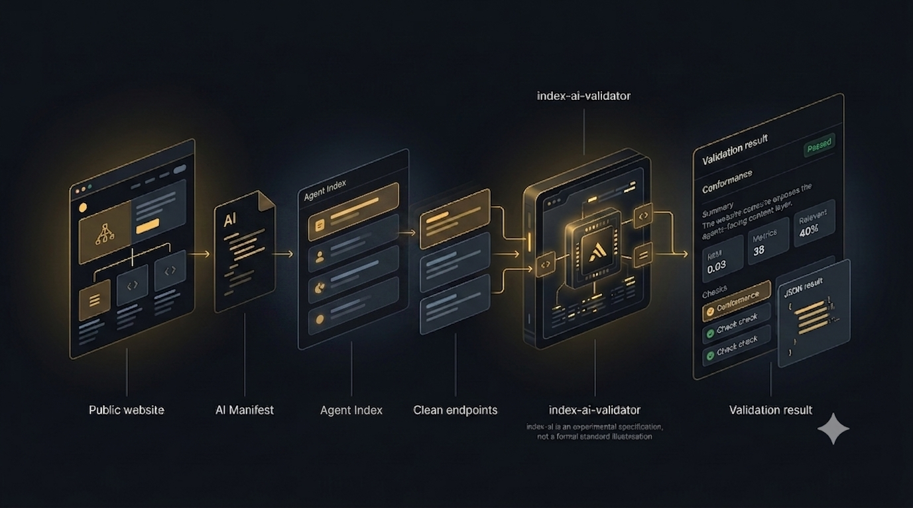

# index-ai-validator

[](https://www.npmjs.com/package/@hardmachinelabs/index-ai-validator)
[](https://www.npmjs.com/package/@hardmachinelabs/index-ai-validator)
[](https://github.com/jordachmakaya/index-ai-validator/actions/workflows/ci.yml)
[](https://github.com/jordachmakaya/index-ai-validator/blob/main/LICENSE)

[](https://github.com/jordachmakaya/index-ai-validator)
[](https://github.com/jordachmakaya/index-ai-validator)
[](https://github.com/jordachmakaya/index-ai-validator)
[](https://github.com/jordachmakaya/index-ai-validator)

[](https://jordachmakaya.github.io/index-ai-validator/)
[](https://github.com/jordachmakaya/index-ai-validator)



`@hardmachinelabs/index-ai-validator` is a free, experimental CLI for the
`index-ai` agent-facing content layer, and it has two commands that answer
two different questions:

- **`validate`** — is a site's already-implemented `index-ai` layer correct?
  Local, free, no dependency beyond the target site itself. Checks Level 1
  AI Manifest and Level 2a Agent Index. There is no Level 3 / MCP check
  implemented.
- **`scan`** — how AI-ready is a site overall, and what would upgrading to
  the full Agent View add? Calls the remote Agent View scanner service and
  returns an AI-readiness score, a verdict, and findings.

Most sites are built for browsers, so agents have to read browser-first
HTML to understand them. `index-ai` is a machine-readable layer built for
agents instead: `validate` checks whether a site exposes that layer
correctly, and `scan` diagnoses how close a site is to full AI-readiness.

This repository contains the `@hardmachinelabs/index-ai-validator` package
and its documentation.

Naming:

- `index-ai-validator` is this validator repository.
- [`index-ai`](https://github.com/jordachmakaya/index-ai) is the
  experimental specification `validate` checks.
- `@hardmachinelabs/index-ai-validator` is the npm package.
- `index-ai` is also the CLI binary name.

## Validator package

Package:

```txt
@hardmachinelabs/index-ai-validator
```

The npm package is published under the HardMachine Labs scope. The CLI
binary remains `index-ai`.

CLI binary:

```txt
index-ai
```

## `validate` — local conformance check

`validate` is the default command — there is no `validate` keyword to
type:

```bash
index-ai <url>
```

It calls `validateIndexAi()`, prints a deterministic human-readable report
by default, and can print stable JSON with `--json`, or write a standalone
HTML report with `--html`. It answers one practical question:

```txt
Does this public website correctly expose the current index-ai
agent-facing content layer?
```

## `scan` — remote Agent View diagnostic

```bash
index-ai scan <url>
```

`scan` calls the remote Agent View scanner service and answers a different
question:

```txt
How AI-ready is this website overall, and what would upgrading to the
full Agent View add?
```

It prints a score, a verdict, and a list of findings by severity (`P0`,
`P1`, `P2`), and can print the raw scanner status as JSON with `--json`, or
write a standalone HTML report with `--html`. Unlike `validate`, `scan`
requires a network call to the scanner API and always exits `0` for a
completed scan, whatever the score.

Examples:

```bash
index-ai scan https://example.com
index-ai scan https://example.com --json
index-ai scan https://example.com --html
index-ai scan https://example.com --timeout 20000
```

A generated example HTML report is committed at
[`packages/validator/.preview/scan-report.html`](https://github.com/jordachmakaya/index-ai-validator/blob/main/packages/validator/.preview/scan-report.html)
in the repository.

See:

- [Package README](packages/validator/README.md) for the full option list,
  JSON shapes, exit codes, and TypeScript usage of both commands.
- [Documentation](docs/index.md)
- [CLI guide](docs/guide/cli.md)

## Scope

`validate` checks public `index-ai` Level 1 and Level 2a behavior:

- AI Manifest fetch, JSON parsing, content type, and schema shape
- Agent Index fetch, graph shape, node fields, and deprecated `pages`
  rejection
- clean endpoint fetches through `llm_url`
- clean endpoint content type, HTML leak, and `content_chars` checks
- conservative security heuristics
- shallow discovery hints
- CLI JSON output, human output, and exit codes

`scan` calls the remote Agent View scanner service for a broader
AI-readiness score, verdict, and findings, including what upgrading to the
full Agent View would add.

Neither command provides legal compliance, production certification, a
security audit, vulnerability scanning, AI traffic guarantees, SEO ranking
guarantees, Level 2b relations, or Level 3 MCP validation.
