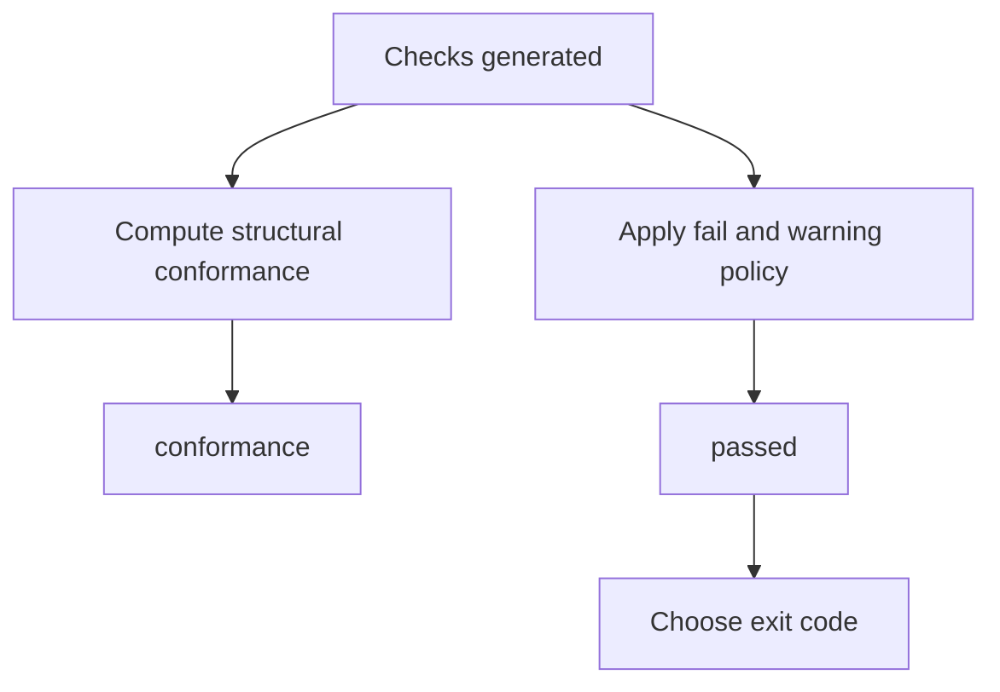

# Conformance vs Passed

`conformance` and `passed` answer different questions.

`conformance` is structural. It describes the highest implemented `index-ai`
level the target satisfies.

`passed` is the global validation verdict. It answers whether the result should
be treated as successful under the current options.

## Conformance

The current validator can return:

| Value | Meaning |
| --- | --- |
| `none` | Level 1 required checks did not pass. |
| `level-1` | Level 1 AI Manifest checks passed, but Level 2a did not fully pass. |
| `level-2a` | Level 1 and Level 2a Shadow Index checks passed. |

The package reserves TypeScript union members for Level 2b and Level 3, but the
current validator does not emit those levels.

## Passed

`passed` is based on validation severity and options:

- any `fail` check makes `passed` false
- `failOnWarn` makes any warning fail the global result
- `strict` makes SHOULD-level warnings fail the global result
- `strictSecurity` upgrades private/internal infrastructure heuristic findings from warn to fail
- discovery warnings do not fail by default

This means a target can have structural `level-2a` conformance while still
returning `passed: false` under stricter options or fail-level security
findings.

## CLI interaction

The CLI exposes both fields in human and JSON output.

Exit codes are based on `passed`, not directly on `conformance`:

| Code | Meaning |
| ---: | --- |
| `0` | A validation result exists and `passed` is `true`. |
| `1` | A validation result exists and `passed` is `false`. |
| `2` | No validation result exists because usage, configuration, or runtime setup failed. |

`--no-exit-code` returns `0` for validation failures only. It does not hide
usage, configuration, or runtime errors before a validation result exists.

## Decision model

## Scope

The highest structural level the validator emits is `level-2a`. For everything
outside that, see [Scope](/guide/scope).
