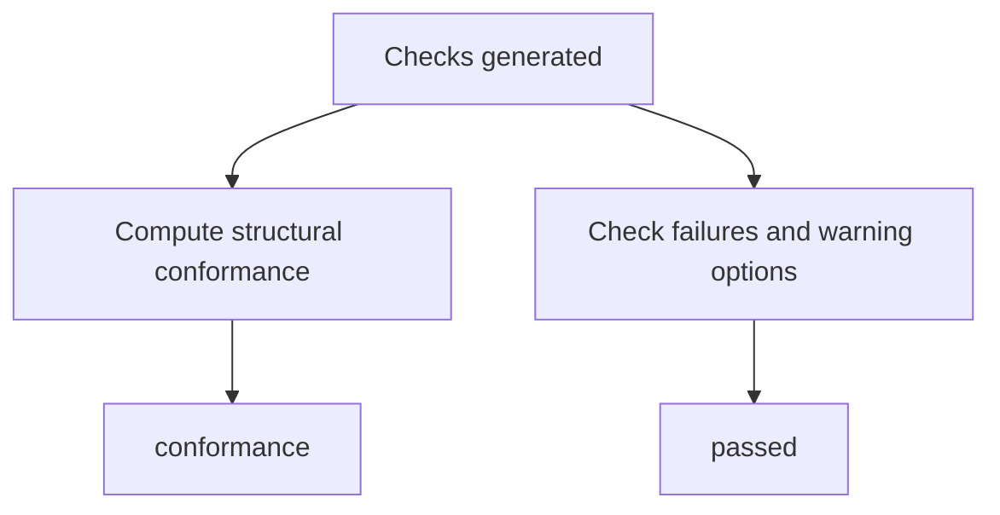

# Conformance vs Passed

`conformance` and `passed` answer different questions.

`conformance` is structural. It describes the highest implemented `index-ai`
level the target satisfies.

`passed` is the global validation verdict. It answers whether the result should
be treated as successful under the current options.

## Conformance

Sprint 4 can return:

| Value | Meaning |
| --- | --- |
| `none` | Level 1 required checks did not pass. |
| `level-1` | Level 1 AI Manifest checks passed, but Level 2a did not fully pass. |
| `level-2a` | Level 1 and Level 2a Shadow Index checks passed. |

`validateIndexAi()` can return `level-2a` when the AI Manifest and Shadow Index
checks pass.

The package reserves types for Level 2b and Level 3, but it does not emit those
levels in the current implementation.

## Passed

`passed` is based on validation severity and options.

In the current implementation:

- any `fail` check makes `passed` false
- `failOnWarn` makes warnings fail the global result
- `strict` can make SHOULD-level warnings fail the global result

This means a target can have a structural conformance level while still failing
the global result under stricter options.

## Decision model

## Current limitations

The CLI command itself is still not the final full validator CLI behavior.
Final CLI JSON output, final exit-code behavior, fixture validation, and CI
validation behavior are not implemented yet.

Security scanning and discovery checks are also not implemented yet, so they do
not currently affect `passed`.

The package does not implement Level 2b relations or Level 3 MCP.
