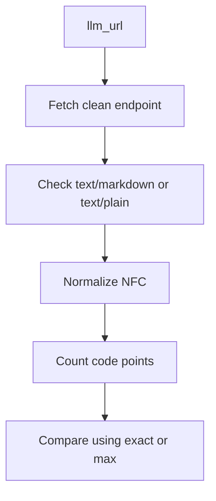

# content_chars

`content_chars` is how an agent knows the token cost of a node before fetching
it. If your declared count is wrong, agents budget wrong. This check keeps it
honest.

`content_chars` is the declared Unicode code point count for a clean `llm_url`
response.

The validator checks `content_chars` as part of Level 2a Shadow Index
validation through both `validateIndexAi()` and the `index-ai` CLI.

## What is implemented now

The validator now checks `content_chars` for fetched clean endpoints.

Implemented behavior:

- clean endpoint fetch through each node `content.llm_url`
- allowed clean endpoint content types: `text/markdown` and `text/plain`
- Unicode NFC normalization before counting
- code point counting, not UTF-16 `.length`
- `content_chars_mode: exact`
- `content_chars_mode: max`
- `content_chars` must be an integer greater than or equal to `1`
- emoji counts as one code point
- decomposed accents are normalized before counting

## Why `.length` is not enough

JavaScript string `.length` counts UTF-16 code units. That is not the same as
the character count required for `content_chars`.

Examples:

```txt
abc        -> 3 code points
e + accent -> normalized, then 1 code point
rocket     -> 1 code point, but JavaScript .length is 2
```

The validator normalizes text to Unicode NFC before counting code points. This
makes composed and decomposed accented text count consistently.

## STEP-1 - Fetch the clean content

For Level 2a, each graph node declares:

```txt
content.llm_url
```

The validator resolves that URL, fetches it, and checks that the response is
served as one of:

```txt
text/markdown
text/plain
```

## STEP-2 - Normalize and count

The fetched body is normalized to Unicode NFC before counting.

```txt
e + combining acute accent -> one normalized code point
```

The count must be a whole number. Decimal values such as `1.5` are invalid, and
`0` is invalid because zero is only a placeholder.

## STEP-3 - Compare by mode

`content_chars_mode` controls how the declared value is compared.

| Mode | Rule |
| --- | --- |
| `exact` | The measured count must equal `content_chars`. |
| `max` | The measured count must be less than or equal to `content_chars`. |

## Measurement flow



## Scope

`content_chars` validation runs on Level 2a Shadow Index clean endpoints through
`validateIndexAi()`. This is experimental documentation of current validator
behavior, not compliance certification or a traffic promise. See
[Scope](/guide/scope).
