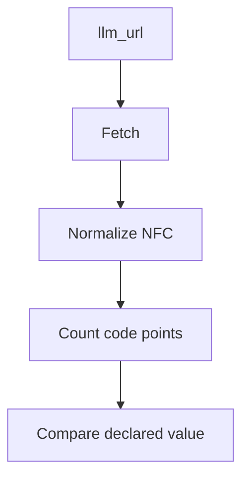

# content_chars

`content_chars` is the declared character count for a clean `llm_url` response.
In `index-ai`, it is meant to be measured from the actual clean content, not
estimated by hand.

The runtime utility layer is available. Later sprints wire these utilities into
manifest and Shadow Index validation.

## What exists now

Sprint 2 added utility code for:

- HTTP text fetching with a timeout policy
- manual redirect handling with a redirect cap
- private-host blocking for URL safety
- URL normalization and same-origin checks
- Unicode NFC code-point counting
- concurrency limiting for endpoint work

Mini Sprint 2.1 added durable Vitest tests for these utilities, including
ASCII text, accented characters, emoji, private host detection, timeout behavior,
redirect cap behavior, and concurrency limiting.

## Why `.length` is not enough

JavaScript string `.length` counts UTF-16 code units. That is not the same as
the character count required for `content_chars`.

For example:

```txt
abc     -> 3 code points
é       -> 1 code point
e + ́   -> normalized to é, then 1 code point
🚀      -> 1 code point, but JavaScript .length is 2
```

The validator utility normalizes text to Unicode NFC before counting code
points. This makes composed and decomposed accented text count consistently.

## STEP-1 — Fetch the clean content

Later validation sprints will use the HTTP utility layer to fetch clean endpoint
content. The fetch policy has bounded behavior:

| Policy | Current utility behavior |
| --- | --- |
| Timeout | A request returns a stable timeout result when it exceeds the configured timeout. |
| Redirects | Redirects are followed manually and capped. |
| Private hosts | Private and local hosts are blocked unless explicitly allowed for trusted local development. |
| Concurrency | Endpoint work can be capped so multiple fetches do not run without a limit. |

These utilities exist now, but the validator does not yet run full Shadow Index
endpoint validation.

## STEP-2 — Normalize before counting

Before counting, content should be normalized to Unicode NFC.

```txt
e + combining acute accent -> é
```

This matters because two strings can look the same while being represented by
different Unicode sequences.

## STEP-3 — Count code points

After normalization, count Unicode code points rather than UTF-16 units.

```txt
🚀
```

The emoji above is one code point. JavaScript `.length` reports `2`, so it is
not suitable for `content_chars`.

## Measurement flow



The final compare step is planned for later validation wiring. At this
checkpoint, the counting and runtime safety utilities are implemented and
tested, but they are not yet connected to end-to-end Shadow Index validation.

## Current limitations

At this checkpoint, Level 1 AI Manifest validation is implemented through
`validateIndexAi()`.

The package does not yet validate:

- Shadow Index files
- `llm_url` clean endpoint responses
- `content_chars` declarations on live websites
- graph structure
- HTML leak detection
- security scanning
- discovery checks
- fixture validation
- CI behavior
- Level 2b relations
- Level 3 MCP

It is not production-grade compliance certification and does not guarantee AI
traffic.
