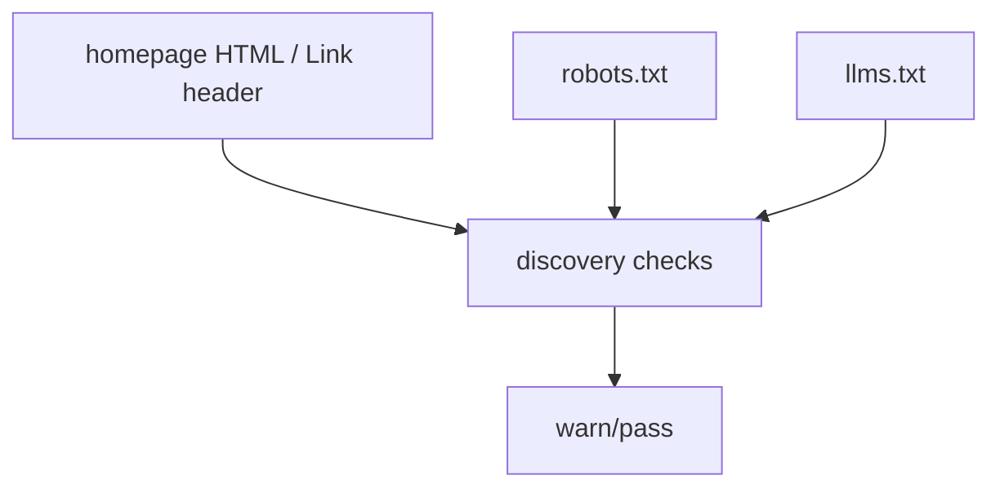

# Discovery Checks

The validator runs shallow discovery checks through `validateIndexAi()` and the
`index-ai` CLI.

These checks inspect explicit hints that help agents find the AI Manifest. They
do not crawl a site, validate a sitemap, or check DNS TXT records.

## Discovery Flow



## Homepage HTML Link

`DISCOVERY_HTML_LINK` checks the homepage HTML for an explicit `ai-index` link.

Recommended hint:

```html
<link rel="ai-index" href="/.well-known/index-ai.json" type="application/json">
```

If the hint is present, the check passes. If it is missing or the homepage
cannot be fetched, the check warns.

## HTTP Link Header

`DISCOVERY_HTTP_LINK_HEADER` checks the homepage response headers for an
`ai-index` link.

Recommended header:

```http
Link: </.well-known/index-ai.json>; rel="ai-index"; type="application/json"
```

If the header is present, the check passes. If it is missing or the homepage
cannot be fetched, the check warns.

## robots.txt AI-Index Hint

`DISCOVERY_ROBOTS_AI_INDEX` checks `/robots.txt` for:

```txt
AI-Index: /.well-known/index-ai.json
```

This is a discovery hint. It does not replace crawler rules and does not create
legal control over AI agents.

## llms.txt Content Type

`DISCOVERY_LLMS_TXT_CONTENT_TYPE` checks that `/llms.txt` is served as plain
text.

Recommended response header:

```http
Content-Type: text/plain; charset=utf-8
```

## llms.txt Bridge

`DISCOVERY_LLMS_TXT_BRIDGE` checks that `/llms.txt` references the AI Manifest.

Recommended text:

```txt
- AI-Index: /.well-known/index-ai.json
```

Mentioning `/.well-known/index-ai.json` directly also satisfies the bridge
check.

## Verdict Interaction

Discovery checks use SHOULD-level warnings.

- Present hints pass.
- Missing hints warn.
- Discovery warnings do not fail `passed` by default.
- `failOnWarn` makes any warning fail `passed`.
- `strict` makes SHOULD-level warnings fail `passed`.

Discovery checks do not change structural `conformance`.

## Current Limits

The validator performs shallow explicit checks only. It does not crawl the site,
validate sitemap entries, inspect DNS TXT records, prove agent adoption, provide
compliance certification, create traffic promises, or validate Level 2b or Level
3 MCP behavior.
