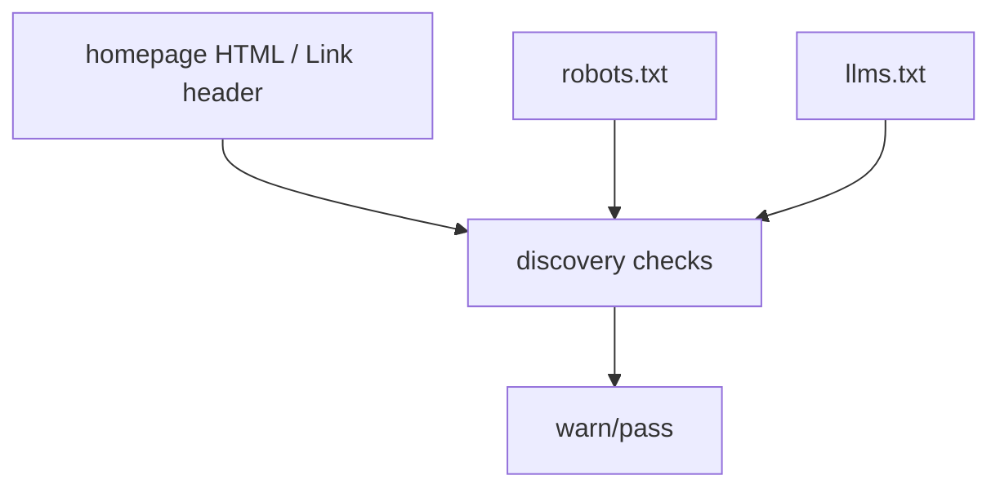

# Discovery Checks


An agent can only use your AI Manifest if it can find it. These checks inspect
the hints that point agents to it.


<div class="audio-explainer">
  <video controls playsinline style="width: 100%; height: auto; border-radius: 12px;" aria-label="How AI agents find your site manifest — audio explainer">
    <source src="/discovery-explained.mp4" type="video/mp4">
    Your browser does not support the video tag. Listen to the audio explainer: <a href="/How_AI_agents_find_your_site_manifest.m4a">How_AI_agents_find_your_site_manifest.m4a</a>.
  </video>
  <p class="audio-explainer-caption">🔊 Audio explainer — how AI agents find your site manifest.</p>
</div>

<div class="illustration-note">
  <svg width="14" height="14" viewBox="0 0 24 24" fill="none" stroke="currentColor" stroke-width="2" stroke-linecap="round" stroke-linejoin="round" aria-hidden="true">
    <circle cx="12" cy="12" r="10"></circle>
    <line x1="12" y1="16" x2="12" y2="12"></line>
    <line x1="12" y1="8" x2="12.01" y2="8"></line>
  </svg>
  <span>Illustrative example — for visual reference only.</span>
</div>


The validator runs shallow discovery checks through `validateIndexAi()` and the
`index-ai` CLI.

These checks inspect explicit hints that help agents find the AI Manifest. They
do not crawl a site, validate a sitemap, or check DNS TXT records.

## Discovery Flow


```mermaid
flowchart TD
  A["homepage HTML / Link header"] --> D["discovery checks"]
  B["robots.txt"] --> D
  C["llms.txt"] --> D
  D --> E["warn/pass"]
```

## Homepage HTML Link

`DISCOVERY_HTML_LINK` checks the homepage HTML for an explicit `agent-manifest` link.

Recommended hint:

```html
<link rel="agent-manifest" href="/.well-known/index-ai.json" type="application/json">
```

If the hint is present, the check passes. If it is missing or the homepage
cannot be fetched, the check warns.

## HTTP Link Header

`DISCOVERY_HTTP_LINK_HEADER` checks the homepage response headers for an
`agent-manifest` link.

Recommended header:

```http
Link: </.well-known/index-ai.json>; rel="agent-manifest"; type="application/json"
```

If the header is present, the check passes. If it is missing or the homepage
cannot be fetched, the check warns.

## robots.txt Agent-Manifest Hint

`DISCOVERY_ROBOTS_AI_INDEX` checks `/robots.txt` for:

```txt
Agent-Manifest: /.well-known/index-ai.json
```

This is a discovery hint. It does not replace crawler rules and does not create
legal control over AI agents.

## llms.txt Content Type

`DISCOVERY_LLMS_TXT_CONTENT_TYPE` checks that `/llms.txt` is served as plain
text.

Recommended response header:

```http
Content-Type: text/plain; charset=utf-8
```

## llms.txt Bridge

`DISCOVERY_LLMS_TXT_BRIDGE` checks that `/llms.txt` references the AI Manifest.

Recommended text:

```txt
- Agent-Manifest: /.well-known/index-ai.json
```

Mentioning `/.well-known/index-ai.json` directly also satisfies the bridge
check.

## Verdict Interaction

Discovery checks use SHOULD-level warnings.

- Present hints pass.
- Missing hints warn.
- Discovery warnings do not fail `passed` by default.
- `failOnWarn` makes any warning fail `passed`.
- `strict` makes SHOULD-level warnings fail `passed`.

Discovery checks do not change structural `conformance`.

## Scope

The validator performs shallow, explicit checks only. It does not crawl the
site, validate sitemap entries, inspect DNS TXT records, or prove agent
adoption. See [Scope](/guide/scope).
