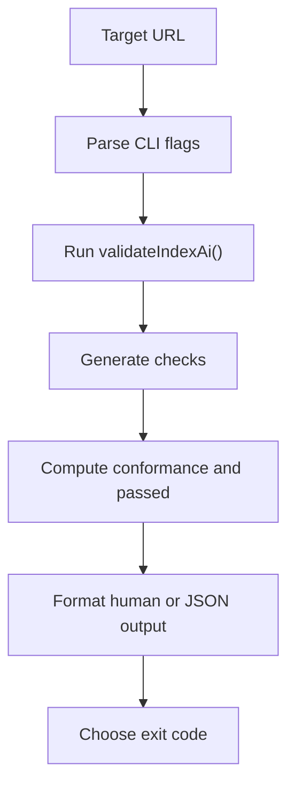

# Getting Started

## What is @hardmachinelabs/index-ai-validator?

`@hardmachinelabs/index-ai-validator` is an experimental free CLI validator for `index-ai` Level
1 and Level 2a.

It checks whether a public website exposes the files, Shadow Index graph, and
clean endpoints expected by the current Level 1 and Level 2a implementation.

## Who is it for?

This package is for developers, maintainers, and technical reviewers working on
public `index-ai` implementations.

Use it when you need structured validation checks for the AI Manifest, Shadow
Index graph, clean endpoint content types, HTML leaks, `content_chars`,
conservative security heuristics, discovery hints, and CLI behavior.

## STEP-1 - Run the CLI

```bash
npx @hardmachinelabs/index-ai-validator https://example.com
```

The package name is `@hardmachinelabs/index-ai-validator`.

The CLI binary is `index-ai`.

## STEP-2 - Read the human report

By default, the CLI prints a deterministic summary-first report:

```txt
index-ai validation result

Target: https://example.com
Duration: 42 ms
Conformance: level-2a
Passed: true

Summary:
- pass: 12
- warn: 0
- fail: 0
- total: 12

Metrics:
- manifest_found: true
- shadow_layer_found: true
- total_nodes: 6
- valid_clean_endpoints: 6
- valid_content_chars: 6

No failures or warnings.

Next:
- No blocking validation fixes were found.
```

Failures and warnings include check codes and fixes where available. Passing
checks are included only when `--verbose` is used.

## STEP-3 - Use JSON for automation

```bash
npx @hardmachinelabs/index-ai-validator https://example.com --json
```

JSON mode writes JSON only to stdout. Normal validation results keep stderr
empty. Usage, configuration, or runtime errors before a validation result use
stderr and exit with code `2`.

The top-level JSON fields include:

- `schema_version`
- `target`
- `generated_at`
- `duration_ms`
- `conformance`
- `passed`
- `summary`
- `metrics`
- `checks`

## What it validates in 0.1.0

Implemented scope:

- canonical AI Manifest fetch at `/.well-known/index-ai.json`
- fallback AI Manifest fetch at `/index-ai.json` with warning
- AI Manifest JSON content-type check
- AI Manifest JSON parse check
- pragmatic AJV Level 1 schema validation
- `identity.domain` host mismatch warning
- manifest `access.shadow_layer`
- Shadow Index graph fetch
- graph JSON content-type check
- graph JSON parse check
- graph schema validation
- `nodes` array validation
- deprecated `pages` array failure
- `total_nodes` mismatch warning
- per-node `llm_url` structural validation
- per-node `llm_url` fetch
- clean endpoint content-type validation
- hard HTML leak failure
- soft inline HTML warning
- `content_chars` exact and max validation
- Unicode NFC code-point counting
- obvious secret-shaped value checks outside Markdown code
- private/internal infrastructure reference checks
- private `llm_url` blocking by default
- shallow discovery hint checks for the homepage, `robots.txt`, and `/llms.txt`
- CLI JSON output, human output, and exit codes

## What it does not validate

This is an experimental validator, not compliance certification or a traffic
promise. For the full list of what it does not do — security audits, crawling,
sitemap and DNS validation, Level 2b, Level 3 MCP — see [Scope](/guide/scope).

## Architecture overview



## Next steps

- [Installation](/guide/installation)
- [CLI](/guide/cli)
- [JSON Output](/guide/json-output)
- [Conformance vs Passed](/guide/conformance-vs-passed)
- [CI](/guide/ci)
