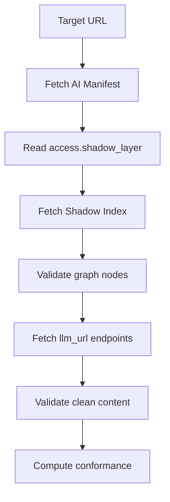

# Getting Started

## What is @index-ai/validator?

`@index-ai/validator` is an experimental free CLI validator for `index-ai` Level
1 and Level 2a.

It helps developers check whether a public website exposes the files and clean
endpoints expected by the current Level 1 and Level 2a implementation.

At the current Sprint 4 checkpoint, Level 1 AI Manifest validation and Level 2a
Shadow Index validation are implemented through `validateIndexAi()`.

## Who is it for?

This package is for developers, maintainers, and technical reviewers working on
public `index-ai` implementations.

Use it when you need structured validation checks for the AI Manifest, Shadow
Index graph, clean endpoint content types, HTML leaks, and `content_chars`
behavior.

## What you get when you run it

The public `validateIndexAi()` entrypoint returns a structured validation result
with:

- `schema_version`
- `target`
- `generated_at`
- `conformance`
- `passed`
- `summary`
- `metrics`
- `checks`

The CLI command itself is still not the final full validator CLI behavior. It
can parse the documented command shape, but final CLI JSON output and final
exit-code behavior are not implemented yet.

## What it validates in 0.1.0

The current implemented scope is Level 1 plus Level 2a.

Implemented through `validateIndexAi()`:

- canonical AI Manifest fetch at `/.well-known/index-ai.json`
- fallback AI Manifest fetch at `/index-ai.json` with warning
- AI Manifest JSON content-type check
- AI Manifest JSON parse check
- pragmatic AJV Level 1 schema validation
- `identity.domain` host mismatch warning
- manifest `access.shadow_layer`
- Shadow Index graph fetch
- graph JSON content-type check
- graph JSON parse check
- graph schema validation
- `nodes` array validation
- deprecated `pages` array failure
- `total_nodes` mismatch warning
- per-node `llm_url` structural validation
- per-node `llm_url` fetch
- clean endpoint content-type validation
- hard HTML leak failure
- soft inline HTML warning
- `content_chars` exact and max validation
- Unicode NFC code-point counting

## What it does not validate

The current Sprint 4 state does not implement:

- security scanning
- discovery checks
- fixture validation
- final CI validation behavior
- final CLI JSON output
- final CLI exit-code behavior
- Level 2b relations
- Level 3 MCP

It is not production-grade compliance certification and does not guarantee AI
traffic.

## Architecture overview

The CLI command itself is still not the final full validator CLI behavior. Use
the current docs to understand the implemented validation entrypoint and the
planned CLI surface separately.

## Next steps

- [Installation](/guide/installation)
- [CLI](/guide/cli)
- [Level 1 Manifest](/guide/level-1-manifest)
- [Level 2a Shadow Index](/guide/level-2a-shadow-index)
- [content_chars](/guide/content-chars)
- [Conformance vs Passed](/guide/conformance-vs-passed)
