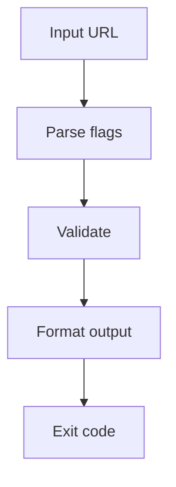

# Getting Started

## What is @index-ai/validator?

`@index-ai/validator` is an experimental free CLI validator for `index-ai` Level 1
and Level 2a.

It is intended to help developers check whether a public website exposes the
files and clean endpoints required by those `index-ai` levels once the validation
checks are added.

At the current Sprint 2 checkpoint, the CLI shell and runtime utility layer are
available. Validation logic is implemented progressively across later sprints.

## Who is it for?

This package is for developers, maintainers, and technical reviewers working on
public `index-ai` implementations.

Use it when you want a command-line tool that can eventually report what passes,
what warns, what fails, and which part of the implementation needs attention.

## What you get when you run it

In Sprint 2, the CLI still prints shell output, and the runtime foundations now
exist behind the package.

Human mode prints the target and a clear message that validation is not
implemented yet.

JSON mode prints a small `not_implemented` JSON object containing the parsed
options. This is shell output only, not the final validation result shape.

The utility layer now includes URL normalization, HTTP timeout handling,
redirect capping, private-host detection, Unicode `content_chars` counting, and
concurrency limiting. These utilities have durable Vitest coverage from Mini
Sprint 2.1.

## What it validates in 0.1.0

The planned 0.1.0 scope is Level 1 and Level 2a only.

For Doc Checkpoint 2, end-to-end validation checks are not implemented yet. Do
not treat the current CLI output as a conformance result.

## What it does not validate

In the current Sprint 2 state, the package does not validate:

- AI Manifest files
- Shadow Index files
- `llm_url` clean endpoint responses
- `content_chars`
- security findings
- discovery hints
- CI pass or fail status
- fixtures
- Level 2b relations
- Level 3 MCP

It is not production-grade compliance certification and does not guarantee AI
traffic.

## Architecture overview

The current CLI flow is intentionally small:

In Sprint 2, the `Validate` step is still a placeholder. Runtime utilities now
exist for HTTP fetching, URL safety, Unicode character counting, and concurrency
limiting. Later sprints add the validator orchestrator and checks.

For the current runtime utility foundation, see:

- [content_chars](/guide/content-chars)

## Next steps

Start with installation, then review the CLI command shape and `content_chars`
counting rules:

- [Installation](/guide/installation)
- [CLI](/guide/cli)
- [content_chars](/guide/content-chars)
