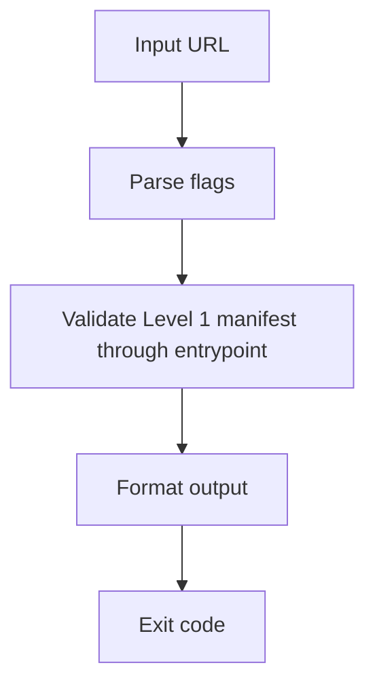

# Getting Started

## What is @index-ai/validator?

`@index-ai/validator` is an experimental free CLI validator for `index-ai` Level 1
and Level 2a.

It is intended to help developers check whether a public website exposes the
files and clean endpoints required by those `index-ai` levels as the validator
is implemented sprint by sprint.

At the current Sprint 3 checkpoint, the CLI shell, runtime utility layer, and
Level 1 AI Manifest validation through `validateIndexAi()` are available.

## Who is it for?

This package is for developers, maintainers, and technical reviewers working on
public `index-ai` implementations.

Use it when you want a validator that reports what passes, what warns, what
fails, and which part of the implementation needs attention. In Sprint 3, that
behavior applies to Level 1 AI Manifest validation through the public TypeScript
entrypoint.

## What you get when you run it

In Sprint 3, the CLI still prints shell output, and the runtime foundations now
exist behind the package.

Human mode prints the target and a clear message that the final full CLI
validation flow is not implemented yet.

JSON mode prints a small `not_implemented` JSON object containing the parsed
options. This is shell output only, not the final validation result shape.

The utility layer now includes URL normalization, HTTP timeout handling,
redirect capping, private-host detection, Unicode `content_chars` counting, and
concurrency limiting. These utilities have durable Vitest coverage from Mini
Sprint 2.1.

The public `validateIndexAi()` entrypoint now performs Level 1 AI Manifest
validation. It fetches the canonical manifest path, can use the fallback path
with a warning, checks JSON content type, parses JSON, validates the Level 1
schema with AJV, and reports `identity.domain` host mismatch warnings.

## What it validates in 0.1.0

The planned 0.1.0 scope is Level 1 and Level 2a only.

For Doc Checkpoint 3, Level 1 AI Manifest validation is implemented in the
validator entrypoint. Full Level 2a validation is not implemented yet.

Currently implemented:

- canonical manifest fetch at `/.well-known/index-ai.json`
- fallback manifest fetch at `/index-ai.json` with warning
- JSON content-type check
- JSON parse check
- pragmatic AJV Level 1 schema validation
- required field checks
- `spec_version` and `manifest_version` checks
- optional `level` validation
- URL field structural validation
- `identity.domain` host mismatch warning

## What it does not validate

In the current Sprint 3 state, the package does not validate:

- Shadow Index files
- graph structure
- `llm_url` clean endpoint responses
- `content_chars` comparisons
- HTML leaks
- security findings
- discovery hints
- CI pass or fail status
- fixtures
- Level 2b relations
- Level 3 MCP

It is not production-grade compliance certification and does not guarantee AI
traffic.

## Architecture overview

The current CLI flow is intentionally small:

In Sprint 3, `validateIndexAi()` can perform Level 1 AI Manifest validation.
The CLI command itself is still not the final full validator CLI behavior.
Later sprints add Shadow Index, graph, endpoint, security, discovery, fixture,
and CI behavior.

For the current runtime utility foundation, see:

- [content_chars](/guide/content-chars)

## Next steps

Start with installation, then review the CLI command shape and `content_chars`
counting rules:

- [Installation](/guide/installation)
- [CLI](/guide/cli)
- [Level 1 Manifest](/guide/level-1-manifest)
- [content_chars](/guide/content-chars)
