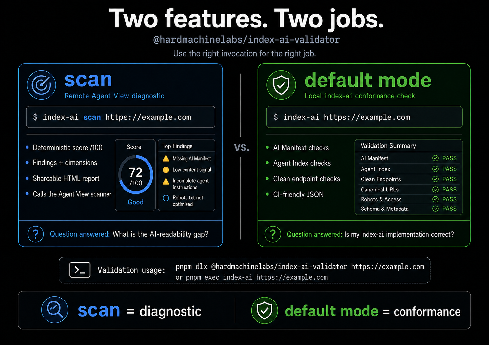
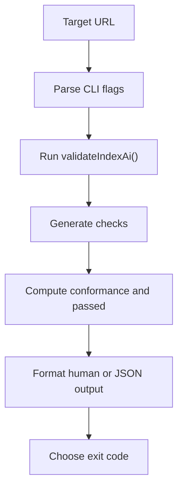
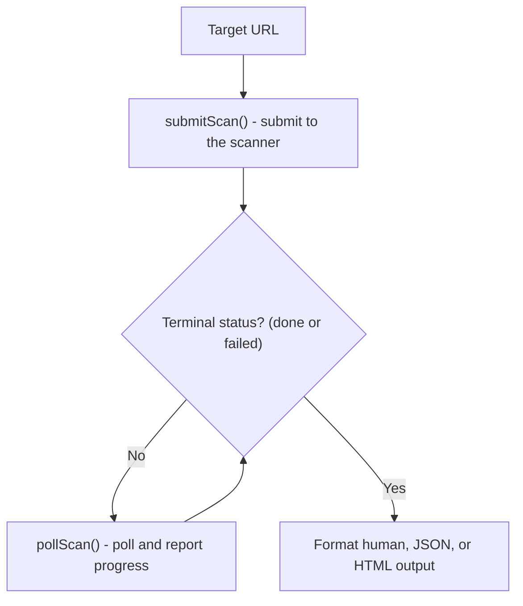

# Getting Started



## What is @hardmachinelabs/index-ai-validator?

`@hardmachinelabs/index-ai-validator` is a free CLI with two features:
Default validation mode and `scan`.

>[!note]
>**Default validation mode** is an experimental conformance checker for
`index-ai` Level 1 and Level 2a. It checks whether a public website exposes
the files, Agent Index graph, and clean endpoints expected by the current
Level 1 and Level 2a implementation. It runs entirely locally — no
dependency beyond the target site itself.

Its counterpart is `scan`:

>[!important]
>`scan` calls the remote Agent View scanner and returns an AI-readiness score,
a verdict, and findings — for any site, whether or not it implements
`index-ai` yet. This page covers Default validation mode; see
[CLI](/guide/cli) for the full `scan` reference.

## Who is it for?

This package is for developers, maintainers, and technical reviewers working on
public `index-ai` implementations, and for anyone who wants a quick, free read
on how AI-ready a site is overall — use Default validation mode once
`index-ai` is implemented, and `scan` when you just want a score and
findings first.

## Default validation mode

### STEP-1 - Run the CLI

```bash
npx @hardmachinelabs/index-ai-validator https://example.com
```

The package name is `@hardmachinelabs/index-ai-validator`.

Its CLI binary is installed under two equivalent names, `index-ai` and
`index-ai-validator` — either one runs the same executable. Default
validation mode runs automatically — no command keyword is required
(`index-ai validate <url>` is the same mode with an explicit keyword, if
you prefer naming it). The rest of this section covers Default validation
mode; skip to [scan](#scan) below for the remote diagnostic.

### STEP-2 - Read the human report

By default, the CLI prints a deterministic summary-first report:

```txt
index-ai validation result

Target: https://example.com
Duration: 42 ms
Conformance: level-2a
Passed: true

Requested target level: Level 2a
Tested levels: Level 1, Level 2a
Achieved level: Level 2a

Level results:
- Level 1: 5 pass, 0 warn, 0 fail
- Level 2a: 7 pass, 0 warn, 0 fail

Summary:
- pass: 12
- warn: 0
- fail: 0
- total: 12

Metrics:
- manifest_found: true
- agent_index_found: true
- total_nodes: 6
- valid_clean_endpoints: 6
- valid_content_chars: 6

No failures or warnings.

Next:
- No blocking validation fixes were found.
```

Failures and warnings include check codes and fixes where available. Passing
checks are included only when `--verbose` is used.

### STEP-3 - Generate a shareable report

```bash
npx @hardmachinelabs/index-ai-validator https://example.com --html
```

With no path after `--html`, the report is written to
`.report/validate-report.html` relative to the current working directory,
creating that directory if it does not exist; with an explicit path
(`--html report.html`), it is written exactly there. It is a standalone
HTML file — no server, no login, nothing else to run — so it opens
directly in a browser or can be sent to someone else as-is. `--html` never
changes `passed`, `conformance`, JSON output, or the exit code; it is a
review aid generated from the same result.

The report renders:

- The CI verdict (`Passed`/`Failed`) and a readiness score — a
  human-readable progress indicator (percentage of checks that passed),
  separate from the pass/fail verdict itself.
- The conformance level (`none`, `level-1`, or `level-2a`) with a short
  hint.
- Up to 5 recommended next steps, prioritized and labeled "Priority fix",
  "Then improve", or "Later", derived from the actual failing/warning
  checks — not a generic checklist.
- Full `Failures` and `Warnings` sections, each check with its code and fix.
- A `Metrics` section (manifest/Agent Index found and schema-valid, node
  and endpoint counts, `llm_url` and `content_chars` coverage percentages).
- A level summary in the hero section: requested target level, tested
  levels, achieved level, failed level (when a level failed), and a
  per-level pass/warn/fail (or skipped-with-reason) breakdown.
- A sidebar with the CI verdict, a checks-severity summary, run metadata
  (generated-at, duration, schema version, readiness, target), and
  resource links.

See [CLI](/guide/cli) for the full option, exit-code, and TypeScript
reference.

### STEP-4 - Use JSON for automation

```bash
npx @hardmachinelabs/index-ai-validator https://example.com --json
```

JSON mode writes JSON only to stdout. Normal validation results keep stderr
empty. Usage, configuration, or runtime errors before a validation result use
stderr and exit with code `2`.

The top-level JSON fields include:

- `schema_version`
- `target`
- `generated_at`
- `duration_ms`
- `conformance`
- `passed`
- `summary`
- `metrics`
- `checks`
- `requested_level`
- `tested_levels`
- `achieved_level`
- `failed_level`
- `level_results`

### What it validates in 0.2.0

Implemented scope:

- canonical AI Manifest fetch at `/.well-known/index-ai.json`
- fallback AI Manifest fetch at `/index-ai.json` with warning
- AI Manifest JSON content-type check
- AI Manifest JSON parse check
- pragmatic AJV Level 1 schema validation
- `identity.domain` host mismatch warning
- manifest `access.agent_index`
- Agent Index graph fetch
- graph JSON content-type check
- graph JSON parse check
- graph schema validation
- `nodes` array validation
- deprecated `pages` array failure
- `total_nodes` mismatch warning
- per-node `llm_url` structural validation
- per-node `llm_url` fetch
- clean endpoint content-type validation
- hard HTML leak failure
- soft inline HTML warning
- `content_chars` exact and max validation
- Unicode NFC code-point counting
- obvious secret-shaped value checks outside Markdown code
- private/internal infrastructure reference checks
- private `llm_url` blocking by default
- shallow discovery hint checks for the homepage, `robots.txt`, and `/llms.txt`
- CLI JSON output, human output, and exit codes

### What it does not validate

This is an experimental validator, not compliance certification or a traffic
promise. For the full list of what it does not do — security audits, crawling,
sitemap and DNS validation, Level 2b, Level 3 MCP — see [Scope](/guide/scope).

### Architecture overview


```mermaid
flowchart TD
  A["Target URL"] --> B["Parse CLI flags"]
  B --> C["Run validateIndexAi()"]
  C --> D["Generate checks"]
  D --> E["Compute conformance and passed"]
  E --> F["Format human or JSON output"]
  F --> G["Choose exit code"]
```

>[!note]
>`scan` follows a different flow — it submits the URL to the remote Agent View
scanner and polls for a result, rather than running checks locally. See
below.

## scan

`scan` calls the remote Agent View scanner and returns an AI-readiness
score, a verdict, a dimension breakdown, and findings — for any site,
whether or not it implements `index-ai` yet. Unlike Default validation
mode, it requires a network call to the scanner API.

### STEP-1 - Run a scan

```bash
npx @hardmachinelabs/index-ai-validator scan https://example.com
```

>[!note]
>The CLI submits the URL to the remote scanner, then polls until the scan
reaches a terminal `done` (or `failed`) result. While it waits, it prints
progress on stderr, one line per stage:

```txt
Scan progress: fetch
Scan progress: robots
Scan progress: render
Scan progress: checks
Scan progress: score
```

### STEP-2 - Read the response

By default, the CLI prints a compact summary:

```txt
URL: https://example.com
Score: 82
Verdict: good
P0: 1
P1: 1
P2: 0
```

`Score` is out of 100. `Verdict` is a short label from the scanner service
— its exact wording can vary, it is not a fixed enum this CLI defines.
`P0`/`P1`/`P2` count findings by severity, most urgent first.

On stderr (printed with or without `--json`), the CLI also prints a link to
the full audit:

```txt
Scan done — score 82, verdict good. Full audit: https://agent-view.com/audit/...
```

### STEP-3 - Generate a shareable scan report

```bash
npx @hardmachinelabs/index-ai-validator scan https://example.com --html
```

With no path after `--html`, the report is written to
`.report/scan-report.html` relative to the current working directory,
creating that directory if it does not exist; with an explicit path
(`--html report.html`), it is written exactly there. It is a standalone
HTML file — no server, no login, nothing else to run — so it opens
directly in a browser or can be sent to someone else as-is. This is the
artifact people forward when they want another person to see the result
without re-running the scan themselves.

>[!note]
>The report renders every field from the JSON result:
>
>- The score out of 100 and the verdict, plus a color-coded recommendation
> strip that changes with the score tier (high, moderate, or low).
>- A per-dimension breakdown: `access`, `extractability`, `citability`,
> `safety`, `agent_layer`.
>- Every finding, grouped by severity (`P0`/`P1`/`P2`), each with its effort
> estimate and a "Fix this" link where the scanner provides one.
>- A noise-ratio, CSR-gap, and render-comparison panel.
>- A sidebar with the verdict, a findings-severity summary, scan metadata
> (engine version, schema version, target), and resource links — including
> a link to the full audit when the scanner provides one.
>- When the `agent_layer` dimension is present and scores below 5, a callout
> pointing to [agent-view.com](https://agent-view.com).

See [CLI](/guide/cli#scan) for the full option, exit-code, and TypeScript
reference.

### STEP-4 - Automate scan with JSON

```bash
npx @hardmachinelabs/index-ai-validator scan https://example.com --json
```

JSON mode prints the raw scanner status object to stdout. Its top-level
fields:

- `scanId`
- `status` — `queued`, `running`, `done`, or `failed`
- `submittedAt`
- `completedAt`
- `result` — present once `status` is `done`: `url`, `score`, `verdict`,
  `dimensions`, `findings`, `noiseRatio`, `engineVersion`, `schemaVersion`
- `meta.links` — `self`, `shareUrl`, `audit`

### What `scan` checks

- Five scored dimensions: `access`, `extractability`, `citability`,
  `safety`, `agent_layer`
- Findings ranked by severity (`P0`, `P1`, `P2`), each with an effort
  estimate and a fix link where available
- A noise ratio, a CSR (client-side-rendering) gap percentage, and a
  rendered-vs-raw comparison status

>[!note]
>Scoring, dimension weights, and finding content are computed and owned by
the remote scanner service, not by this package, and can change
independently of this package's version.

### What `scan` does not check

`scan` has no separate pass/fail exit code the way Default validation mode
does — a low score or `P0` findings still exit `0`; only a request or usage
failure exits non-zero. It is a diagnostic, not compliance certification or
a traffic promise — see [Scope](/guide/scope).

### Scan architecture overview


```mermaid
flowchart TD
  A["Target URL"] --> B["submitScan() - submit to the scanner"]
  B --> C{"Terminal status? (done or failed)"}
  C -->|No| D["pollScan() - poll and report progress"]
  D --> C
  C -->|Yes| E["Format human, JSON, or HTML output"]
```

## Next steps

- [Installation](/guide/installation)
- [CLI](/guide/cli)
- [JSON Output](/guide/json-output)
- [Conformance vs Passed](/guide/conformance-vs-passed)
- [CI](/guide/ci)
