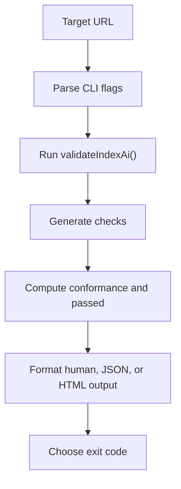
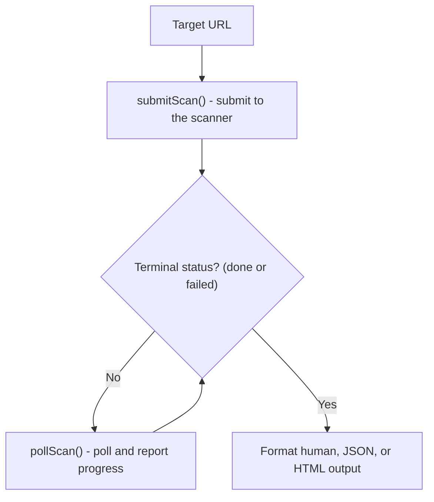

# Getting Started


## Two commands. Two different jobs

`@hardmachinelabs/index-ai-validator` gives you two ways to inspect a public website.

They answer different questions.

```txt
index-ai validate <url>   Check whether an Agent View / index-ai implementation is valid.
index-ai scan <url>       Measure whether a site is usable by AI agents. (coming soon)
```

> [!warning]
> `scan` is not yet publicly available. It depends on the agent-view.com
> service, which has not launched yet. See [the CLI reference](/guide/cli#scan)
> for updates. `validate` is fully available today — use it first.

Use `validate` when you want to know:

**Did I implement the Agent View / index-ai layer correctly?**

Use `scan` when you want to know (once it is available):

**Can AI agents access, extract, cite, and understand this website?**

> [!tip]
> `validate` is also the default mode.
> `index-ai https://example.com` and `index-ai validate https://example.com` run the same local validation mode.

## What is this package?

`@hardmachinelabs/index-ai-validator` is a CLI for AI-readable web infrastructure.

It has two jobs:

1. **`validate`** — a local conformance check for sites implementing `index-ai`.
2. **`scan`** (coming soon) — a remote Agent View diagnostic for any public website.

These are related, but they are not the same.

`validate` checks the proposed fix: the Agent View / index-ai layer.

`scan` measures the agent-readiness gap, once it is publicly available.

## Which command should I use?

| If you want to know...                   | Use                                | Why                                                                  |
| ---------------------------------------- | ---------------------------------- | -------------------------------------------------------------------- |
| Is my Agent View implementation correct? | `validate`                         | It checks Level 1, Level 2a, and Level 2b conformance locally.       |
| I already added an Agent View layer      | `validate`                         | It checks whether the implementation is valid.                       |
| Can AI agents use this website well?     | `scan` (coming soon)               | It will return an AI-readiness score, verdict, dimensions, and findings. |
| I have not implemented `index-ai` yet    | `scan` (coming soon)               | It will work for any public site.                                    |
| I want a shareable report                | `validate --html` (`scan --html` coming soon) | Both modes can generate standalone HTML reports.       |
| I want automation                        | `--json`                           | Both modes support JSON output.                                      |

## Quick start

### 1. Validate an Agent View implementation with `validate`

Run:

```bash
npx @hardmachinelabs/index-ai-validator validate https://example.com
```

Or use the default mode:

```bash
npx @hardmachinelabs/index-ai-validator https://example.com
```

Both commands run the same local validation mode.

`validate` answers:

**Is my Agent View / index-ai implementation correct?**

It checks whether the target site exposes the expected `index-ai` layer.

In version `0.2.0`, the default target level is `l2a`.

You can also choose the target level explicitly:

```bash
npx @hardmachinelabs/index-ai-validator validate https://example.com --target-level l1
```

```bash
npx @hardmachinelabs/index-ai-validator validate https://example.com --target-level l2a
```

`l2b` is not available yet.

### 2. Measure agent-readiness with `scan` (coming soon)

> [!warning]
> `scan` is not yet publicly available. It depends on the agent-view.com
> service, which has not launched yet. See [the CLI reference](/guide/cli#scan)
> for updates. The steps below describe `scan` as it will behave once the
> service is live.

Once available, run:

```bash
npx @hardmachinelabs/index-ai-validator scan https://example.com
```

`scan` will call the remote Agent View scanner.

It is the diagnostic path.

It will answer:

**Can AI agents access, extract, cite, and understand this website?**

A scan will be able to return:

* an AI-readiness score;
* a verdict;
* prioritized findings;
* dimension scores;
* a compact terminal summary;
* raw JSON for automation;
* and a shareable HTML report.

Example human output:

```txt
URL: https://example.com
Score: 82
Verdict: good
P0: 1
P1: 1
P2: 0
```

`Score` is out of 100.

`P0`, `P1`, and `P2` are finding severities, ordered from most urgent to least urgent.

> [!note]
> `scan` requires the remote scanner service. Once that service is public,
> if it is unavailable, the CLI can start correctly but still fail with a
> network error.

## See the CLI shape

Run:

```bash
npx @hardmachinelabs/index-ai-validator --help
```

Expected shape:

```txt
Agent View CLI
AI-readable website validation for the Agent Web.

Usage: index-ai [options] <url>

Validate index-ai Level 1 and Level 2a agent-facing content layers.

Two modes:
  index-ai validate <url>  Run full validation checks (also the default when no
subcommand is given).
  index-ai scan <url>      Run the Agent View scanner service against a site and
print its findings. (coming soon)

Arguments:
  url                       Site URL to validate, for example
                            https://example.com

Options:
  -V, --version             output the version number
  --json                    Print stable JSON output
  --verbose                 Print all checks, including passed checks
  --strict                  Treat should-level warnings as a failed validation
                            result
  --strict-security         Fail on private infra patterns such as IPs or
                            internal hostnames
  --fail-on-warn            Treat any warning as a failed validation result
  --allow-private-hosts     Allow private/internal hosts in target and llm_url
                            fetches
  --no-exit-code            Return exit code 0 for validation failures
  --html [path]             Write a standalone HTML report to the provided .html
                            path, or to .report/validate-report.html if no path
                            is given
  --timeout <ms>            Request timeout in milliseconds (default: 10000)
  --max-concurrency <n>     Maximum concurrent llm_url fetches (default: 5)
  --target-level <level>    Target conformance level to validate against ('l1'
                            or 'l2a'; 'l2b' is not yet available) (default:
                            "l2a")
  -h, --help                display help for command

Commands:
  validate [options] <url>  Validate index-ai Level 1 and Level 2a agent-facing
                            content layers (same as the default mode).
  scan [options] <url>      Scan a site via the Agent View scanner service and
                            print the scan result. (coming soon)
```

The banner line only appears in an interactive terminal — piped or
redirected output (as in CI) omits it, everything else stays identical.

Run the scan help:

```bash
npx @hardmachinelabs/index-ai-validator scan --help
```

Expected shape:

```txt
Usage: index-ai scan [options] <url>

Scan a site via the Agent View scanner service and print the scan result. (coming soon)

Arguments:
  url              Site URL to scan, for example https://example.com

Options:
  --json           Print the raw scanner status as JSON
  --html [path]    Write a minimal HTML report to the provided .html path, or to
                   .report/scan-report.html if no path is given
  --api-key <key>  Reserved for future scanner authentication (currently has no
                   effect)
  --timeout <ms>   Scan request timeout in milliseconds (default: 10000)
  -h, --help       display help for command
```

## `scan`: remote Agent View diagnostic (coming soon)

> [!warning]
> `scan` is not yet publicly available. It depends on the agent-view.com
> service, which has not launched yet. See [the CLI reference](/guide/cli#scan)
> for updates. The rest of this section documents `scan` as it will behave
> once the service is live.

Use `scan` when you want a fast diagnostic for any public site.

The site does not need to implement `index-ai`.

```bash
npx @hardmachinelabs/index-ai-validator scan https://example.com
```

The scanner can report:

* AI-readiness score;
* verdict;
* prioritized findings;
* severity counts: `P0`, `P1`, `P2`;
* dimensions;
* scan analysis;
* report links when provided by the scanner service.

### What `scan` measures

`scan` is designed around five dimensions:

* `access`;
* `extractability`;
* `citability`;
* `safety`;
* `agent_layer`.

It can also include scan analysis signals such as:

* noise ratio;
* CSR gap;
* rendered-vs-raw comparison status.

> [!note]
> Scoring, dimension weights, and finding content are computed by the remote scanner service and can evolve independently of the CLI package version.

### Generate a scan HTML report

```bash
npx @hardmachinelabs/index-ai-validator scan https://example.com --html
```

With no path after `--html`, the report is written to:

```txt
.report/scan-report.html
```

With an explicit path:

```bash
npx @hardmachinelabs/index-ai-validator scan https://example.com --html scan-report.html
```

The report is a standalone HTML file.

It can include:

* score out of 100;
* verdict;
* recommendation strip;
* dimension breakdown;
* findings grouped by severity;
* effort estimates;
* fix links when provided by the scanner;
* noise-ratio panel;
* CSR-gap panel;
* render-comparison panel;
* scan metadata;
* resource links;
* full audit link when provided by the scanner.

> [!important]
> If the remote scanner service cannot be reached, no successful scan report should be treated as generated. A network failure means the service call failed, not that the package failed to install or execute.

### Use scan JSON

```bash
npx @hardmachinelabs/index-ai-validator scan https://example.com --json
```

JSON mode prints the raw scanner status object.

Top-level fields can include:

* `scanId`;
* `status`;
* `submittedAt`;
* `completedAt`;
* `result`;
* `meta.links`.

When `status` is `done`, `result` can include:

* `url`;
* `score`;
* `verdict`;
* `dimensions`;
* `findings`;
* `noiseRatio`;
* `engineVersion`;
* `schemaVersion`.

## `validate`: local conformance check

Use `validate` after you implement Agent View / `index-ai`.

```bash
npx @hardmachinelabs/index-ai-validator validate https://example.com
```

Or:

```bash
npx @hardmachinelabs/index-ai-validator https://example.com
```

`validate` runs locally against the target site.

It does not call the remote scanner.

It checks whether the target exposes the expected `index-ai` files, discovery hints, Agent Index graph, clean endpoints, and content-size signals.

### Example human output

```txt
index-ai validation result

Target: https://example.com
Duration: 42 ms
Conformance: level-2a
Passed: true

Requested target level: Level 2a
Tested levels: Level 1, Level 2a
Achieved level: Level 2a

Level results:
- Level 1: 22 pass, 0 warn, 0 fail
- Level 2a: 37 pass, 0 warn, 0 fail

Summary:
- pass: 59
- warn: 0
- fail: 0
- total: 59

Metrics:
- manifest_found: true
- agent_index_found: true
- total_nodes: 6
- valid_clean_endpoints: 6
- valid_content_chars: 6

No failures or warnings.

Next:
- No blocking validation fixes were found.
```

Failures and warnings include check codes and fixes where available.

Passing checks are included only when `--verbose` is used.

### Choose a target level

Validate only Level 1:

```bash
npx @hardmachinelabs/index-ai-validator validate https://example.com --target-level l1
```

Validate Level 1 plus Level 2a:

```bash
npx @hardmachinelabs/index-ai-validator validate https://example.com --target-level l2a
```

Default:

```txt
--target-level l2a
```

If Level 1 fails, Level 2a is marked as skipped rather than failed.

That makes the report easier to understand: first fix the blocking lower level, then validate the next layer.

### Generate a validate HTML report

```bash
npx @hardmachinelabs/index-ai-validator validate https://example.com --html
```

With no path after `--html`, the report is written to:

```txt
.report/validate-report.html
```

With an explicit path:

```bash
npx @hardmachinelabs/index-ai-validator validate https://example.com --html validate-report.html
```

The report is a standalone HTML file.

It can include:

* CI verdict;
* readiness score;
* conformance level;
* recommended next steps;
* failures and warnings;
* check codes;
* fixes;
* metrics;
* requested target level;
* tested levels;
* achieved level;
* failed level when applicable;
* per-level pass / warn / fail breakdown;
* skipped levels with reasons;
* run metadata;
* resource links.

`--html` does not change the validation result, JSON output, or exit code.

It is a review artifact generated from the same validation result.

### Use validate JSON

```bash
npx @hardmachinelabs/index-ai-validator validate https://example.com --json
```

JSON mode writes JSON only to stdout.

Normal validation results keep stderr empty.

Top-level JSON fields include:

* `schema_version`;
* `target`;
* `generated_at`;
* `duration_ms`;
* `conformance`;
* `passed`;
* `summary`;
* `metrics`;
* `checks`;
* `requested_level`;
* `tested_levels`;
* `achieved_level`;
* `failed_level`;
* `level_results`.

## What `validate` checks in 0.2.0

Implemented scope:

* canonical AI Manifest fetch at `/.well-known/index-ai.json`;
* fallback AI Manifest fetch at `/index-ai.json` with warning;
* AI Manifest JSON content-type check;
* AI Manifest JSON parse check;
* pragmatic AJV Level 1 schema validation;
* `identity.domain` host mismatch warning;
* manifest `access.agent_index`;
* Agent Index graph fetch;
* graph JSON content-type check;
* graph JSON parse check;
* graph schema validation;
* `nodes` array validation;
* deprecated `pages` array failure;
* `total_nodes` mismatch warning;
* per-node `llm_url` structural validation;
* per-node `llm_url` fetch;
* clean endpoint content-type validation;
* hard HTML leak failure;
* soft inline HTML warning;
* `content_chars` exact and max validation;
* Unicode NFC code-point counting;
* obvious secret-shaped value checks outside Markdown code;
* private/internal infrastructure reference checks;
* private `llm_url` blocking by default;
* shallow discovery hint checks for the homepage, `robots.txt`, and `/llms.txt`;
* CLI JSON output, human output, and exit codes.

## What this package does not promise

`index-ai-validator` is experimental.

It is not:

* legal compliance certification;
* SEO ranking certification;
* traffic guarantee;
* security audit;
* vulnerability scan;
* full crawler;
* sitemap validator;
* DNS validator;
* Level 2b validator;
* Level 3 MCP validator.

For details, see [Scope](/guide/scope).

## Architecture overview

### validate flow


```mermaid
flowchart TD
  A["Target URL"] --> B["Parse CLI flags"]
  B --> C["Run validateIndexAi()"]
  C --> D["Generate checks"]
  D --> E["Compute conformance and passed"]
  E --> F["Format human, JSON, or HTML output"]
  F --> G["Choose exit code"]
```

### scan flow


```mermaid
flowchart TD
  A["Target URL"] --> B["submitScan() - submit to the scanner"]
  B --> C{"Terminal status? (done or failed)"}
  C -->|No| D["pollScan() - poll and report progress"]
  D --> C
  C -->|Yes| E["Format human, JSON, or HTML output"]
```
