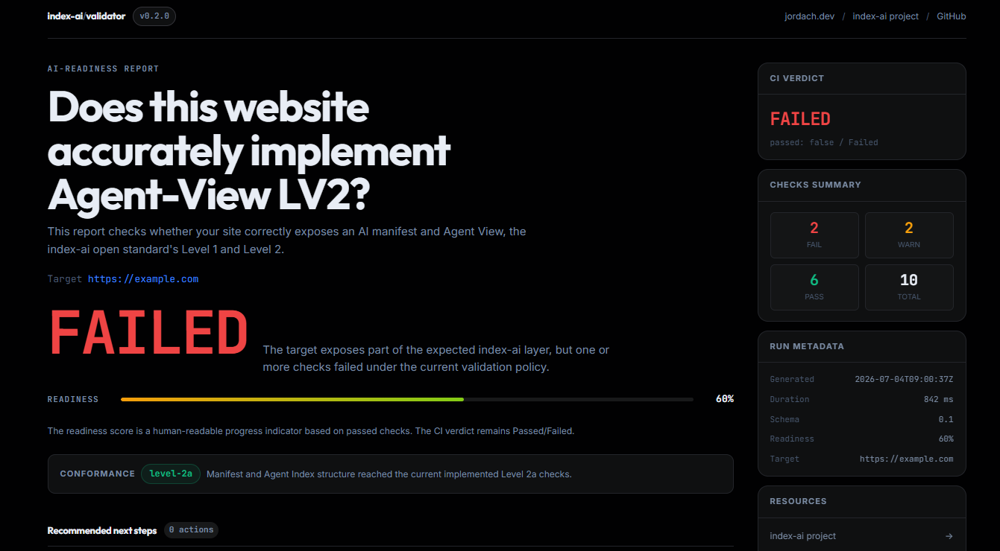
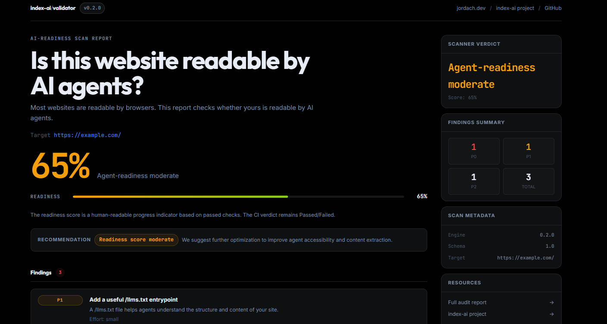

# HTML Report

Use the HTML report when you want a standalone, shareable file for human
review — no server, no login, nothing else to run. It opens directly in a
browser and can be sent to someone else as-is.

```bash
index-ai https://example.com --html report.html
index-ai scan https://example.com --html report.html
```

Both commands accept `--html`. The HTML report never changes `passed`,
`conformance`, JSON output, or exit codes — it is a review aid generated
from the same result as the human and JSON output. See
[Scope](/guide/scope).

## Which command produces it

| Command | Flag | Default path (no value given) |
| --- | --- | --- |
| Default validation mode (`index-ai <url>`) | `--html [path]` | `.report/validate-report.html` |
| `scan` (`index-ai scan <url>`) | `--html [path]` | `.report/scan-report.html` |

With no path after `--html`, the report is written to the default path
relative to the current working directory, creating that directory if it
does not exist. With an explicit path (`--html report.html`), it is
written exactly there, and its parent directory is also created if
missing.

## Default validation mode report



>[!warning]
>This screenshot predates the T5.30 report redesign and no longer matches
the current visual layout (design direction, colors, and structure changed).
Regenerating it requires a human to run the CLI and capture a fresh
screenshot — not something an agent can do. The report's actual content
and behavior described below are current and accurate.

The image above is only the header of the report — the full report
continues below it on the page.

The report renders:

- The CI verdict (`Passed`/`Failed`) and a readiness score — a
  human-readable progress indicator (percentage of checks that passed),
  kept separate from the pass/fail verdict itself.
- The conformance level (`none`, `level-1`, `level-2a`, or `level-2b`) with
  a short hint.
- A level-aware summary driven by the `--target-level <level>` flag (see
  [CLI reference](/guide/cli) for the full flag detail): `Requested target
  level`, `Tested levels`, `Achieved level`, and — only when a tested level
  failed — `Failed level`. Below that, a per-level breakdown showing either
  `<pass> pass, <warn> warn, <fail> fail` for each level that was tested, or
  `skipped (<reason>)` for a level the cascade did not test (for example,
  because an earlier level failed).
- Up to 5 recommended next steps, prioritized and labeled "Priority fix",
  "Then improve", or "Later", derived from the actual failing/warning
  checks.
- `Failures`, `Warnings`, and `Passed checks` sections — every check is
  listed here, not just failures, and each is an expandable item with its
  code, requirement level, message, URL, fix suggestion, and evidence
  where available. Unlike the terminal human output, the HTML report does
  not hide passing checks behind `--verbose` — it always shows all of
  them, since it is a full review artifact.
- A `Metrics` section (manifest/Agent Index found and schema-valid, node
  and endpoint counts, `llm_url` and `content_chars` coverage
  percentages).
- A sidebar with the CI verdict, a checks-severity summary, run metadata
  (generated-at, duration, schema version, readiness, target), and
  resource links.

## `scan` report



>[!warning]
>This screenshot predates the T5.30 report redesign and no longer matches
the current visual layout. See the note above.

The image above is only the header of the report — the full report
continues below it on the page.

The report renders:

- The score out of 100 and the verdict, plus a color-coded recommendation
  strip that changes with the score tier (high, moderate, or low).
- A per-dimension breakdown: `access`, `extractability`, `citability`,
  `safety`, `agent_layer`.
- Every finding, grouped by severity (`P0`/`P1`/`P2`), each with its
  effort estimate and a "Fix this" link where the scanner provides one.
- A noise-ratio, CSR-gap, and render-comparison panel.
- When the `agent_layer` dimension is present and scores below 5, a
  callout pointing to [agent-view.com](https://agent-view.com).
- A sidebar with the scanner verdict, a findings-severity summary, scan
  metadata (engine version, schema version, target), and resource links
  — including a link to the full audit when the scanner provides one.

## AI Fix Prompt

When a report has failures or blocking findings (either report — Default
validation mode or `scan`), it includes an **AI Fix Prompt** card: a
button labeled "Copy Prompt" that copies a ready-to-paste remediation
prompt to the clipboard, for coding agents like Claude Code, Cursor, or
Windsurf.

The prompt itself is never displayed on the page — only the button is
visible. It is assembled deterministically from stable check codes and
finding ids, never from raw unsanitized content read off the scanned or
validated site, so a hostile target site cannot inject arbitrary text into
what gets pasted into your coding agent.

The card follows the same one-blocker-at-a-time principle as the rest of
the report: it points at the current blocking issue only, not every issue
at once, and disappears entirely once there is nothing left to fix — a
true passing report (including a true Level 2b pass) shows a success state
instead, with no Fix Prompt card.

## Clean, professional, shareable

Both reports are self-contained HTML files with no external dependency at
view time — the CLI provides a clean, professional HTML report ready to
be shared with a teammate, a manager, or a client, without asking them to
install anything or read raw JSON.

## Scope

Neither report is compliance certification, a traffic guarantee, an SEO
ranking guarantee, a security audit, or a vulnerability scan. See
[Scope](/guide/scope).
