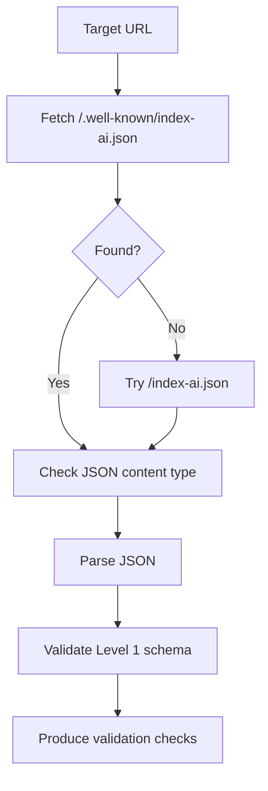

# Level 1 Manifest

Level 1 starts with the AI Manifest. It is a JSON document that describes the
site identity, freshness metadata, and machine-readable entry points for an
`index-ai` implementation.

Sprint 3 implements Level 1 AI Manifest validation in the validator entrypoint.
The CLI command is still not the final full validator CLI behavior.

## What the AI Manifest is

The AI Manifest is the first public file the validator checks for Level 1. It
answers basic questions:

- What site or publisher does this file describe?
- Which `index-ai` spec version does it target?
- When was the described content updated or generated?
- Which URL fields point to related machine-readable resources?

Level 1 is structural. It does not check Shadow Index content, clean endpoints,
`content_chars` comparisons, security scanning, discovery hints, fixtures, or CI
behavior.

## Manifest location

The canonical manifest path is:

```txt
/.well-known/index-ai.json
```

The validator also accepts this fallback path:

```txt
/index-ai.json
```

Using the fallback path produces a warning because the canonical path is still
preferred for Level 1.

## Validation flow



## Required Level 1 fields

The Sprint 3 schema requires:

| Field | Required | Rule |
| --- | ---: | --- |
| `spec_version` | Yes | Must be `"1.0"`. |
| `manifest_version` | Yes | Must be `1`. |
| `identity` | Yes | Must include `name` and `description`. |
| `freshness` | Yes | Must be an object. |

If `level` is present, it must be `level-1` or `level-2a`. The field is not used
to claim Level 2a validation during Sprint 3.

URL-like manifest fields are checked structurally. The current rule accepts
absolute `http` or `https` URLs and root-relative paths.

## Content type and JSON

The manifest response must be served as JSON.

Accepted content types include:

```txt
application/json
application/*+json
```

The body must parse as valid JSON before schema validation runs. If JSON parsing
fails, schema validation is skipped and the result contains a JSON failure check.

## Domain warning

If `identity.domain` is missing or does not match the host serving the manifest,
the validator reports a warning.

This is a Level 1 consistency warning. It is not a security scan and it is not a
legal ownership check.

## Validation checks

Sprint 3 maps manifest behavior into validation checks:

| Check | Meaning |
| --- | --- |
| `L1_MANIFEST_FOUND` | A manifest was found at the canonical path or fallback path. |
| `L1_FALLBACK_MATCH` | The fallback path was used instead of the canonical path. |
| `L1_MANIFEST_CONTENT_TYPE` | The manifest response used a JSON content type. |
| `L1_MANIFEST_JSON_VALID` | The manifest response parsed as JSON. |
| `L1_MANIFEST_SCHEMA_VALID` | The parsed JSON matched the Level 1 schema. |
| `L1_DOMAIN_MATCH` | `identity.domain` matched the manifest host, or warned if not. |

Failures include actionable messages and fixes where possible.

## TypeScript entrypoint

Sprint 3 exposes Level 1 validation through `validateIndexAi()`.

```ts
import { validateIndexAi } from '@index-ai/validator'

const result = await validateIndexAi({
  target: 'https://example.com',
  strict: false,
  strictSecurity: false,
  failOnWarn: false,
  verbose: false,
  timeoutMs: 10000,
  maxConcurrency: 5,
  allowPrivateHosts: false,
})
```

| Option | Required | Default | Description |
| --- | ---: | --- | --- |
| `target` | Yes | - | Target website URL. Must use `http` or `https`. |
| `strict` | No | `false` | Treats SHOULD-level warnings as failures in the global result. |
| `strictSecurity` | No | `false` | Reserved for later security checks. |
| `failOnWarn` | No | `false` | Makes warnings fail the global result. |
| `verbose` | No | `false` | Reserved for output detail. |
| `timeoutMs` | No | `10000` | Manifest request timeout in milliseconds. |
| `maxConcurrency` | No | `5` | Parsed option; endpoint concurrency is used in later checks. |
| `allowPrivateHosts` | No | `false` | Allows private/local hosts for trusted local development. |

## Current limitations

Sprint 3 does not implement:

- Shadow Index validation
- graph validation
- `content_chars` comparison
- HTML leak detection
- security scanning
- discovery checks
- fixture validation
- CI-specific behavior
- Level 2b relations
- Level 3 MCP

The package does not certify compliance, guarantee AI traffic, or provide legal
control over AI agents.
