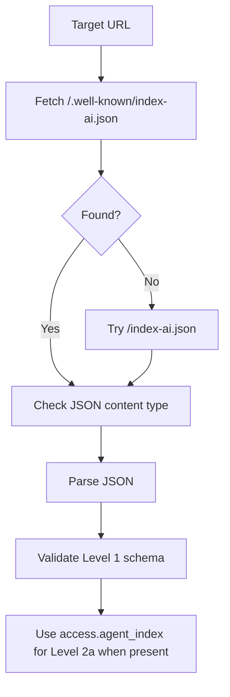

# Level 1 Manifest

Level 1 starts with the AI Manifest. It is a JSON document that describes the
site identity, freshness metadata, and machine-readable entry points for an
`index-ai` implementation.


<div class="audio-explainer">
  <video controls playsinline style="width: 100%; height: auto; border-radius: 12px;" aria-label="Level 1 manifests make websites AI-readable — audio explainer">
    <source src="/level-1-manifest-explained.mp4" type="video/mp4">
    Your browser does not support the video tag. Listen to the audio explainer: <a href="/Level-1_manifests_make_websites_AI_readable.m4a">Level-1_manifests_make_websites_AI_readable.m4a</a>.
  </video>
  <p class="audio-explainer-caption">🔊 Audio explainer — Level 1 manifests make websites AI-readable.</p>
</div>

<div class="illustration-note">
  <svg width="14" height="14" viewBox="0 0 24 24" fill="none" stroke="currentColor" stroke-width="2" stroke-linecap="round" stroke-linejoin="round" aria-hidden="true">
    <circle cx="12" cy="12" r="10"></circle>
    <line x1="12" y1="16" x2="12" y2="12"></line>
    <line x1="12" y1="8" x2="12.01" y2="8"></line>
  </svg>
  <span>Illustrative example — for visual reference only.</span>
</div>


>[!important]
>Level 1 is the base for Level 2a. The public `validateIndexAi()` entrypoint and
the `index-ai` CLI validate the AI Manifest before attempting Agent Index
validation.

## What the AI Manifest is

The AI Manifest is the first public file the validator checks. It answers basic
questions:

- What site or publisher does this file describe?
- Which `index-ai` spec version does it target?
- When was the described content updated or generated?
- Which URL fields point to related machine-readable resources?

Level 1 is structural. Level 2a builds on it by using the current
`access.agent_index` manifest field to find and validate the Agent Index.

## Manifest location

The canonical manifest path is:

```txt
/.well-known/index-ai.json
```

The validator also accepts this fallback path:

```txt
/index-ai.json
```

Using the fallback path produces a warning because the canonical path is still
preferred for Level 1.

## Validation flow


```mermaid
flowchart TD
  A["Target URL"] --> B["Fetch /.well-known/index-ai.json"]
  B --> C{"Found?"}
  C -->|No| D["Try /index-ai.json"]
  C -->|Yes| E["Check JSON content type"]
  D --> E
  E --> F["Parse JSON"]
  F --> G["Validate Level 1 schema"]
  G --> H["Use access.agent_index for Level 2a when present"]
```

## Required Level 1 fields

The current schema requires:

| Field | Required | Rule |
| --- | ---: | --- |
| `spec_version` | Yes | Must be `"1.0"`. |
| `manifest_version` | Yes | Must be `1`. |
| `identity` | Yes | Must include `name` and `description`. |
| `freshness` | Yes | Must be an object. |

If `level` is present, it must be `level-1` or `level-2a`.

URL-like manifest fields are checked structurally. The current rule accepts
absolute `http` or `https` URLs and root-relative paths.

## Agent Index declaration

Level 2a validation uses:

```txt
access.agent_index
```

When present, the validator resolves this path against the target URL and tries
to fetch the Agent Index graph. `/agent-index.json` is the expected graph target
when a manifest declares that path.

`access.agent_index` is the manifest field name that points to the Agent Index
graph.

## Content type and JSON

The manifest response must be served as JSON.

The check accepts a content type if it is exactly `application/json`, or if it
ends with `+json` — with no constraint that it start with `application/`. For
example, `application/ld+json`, `text/vnd.api+json`, and even a nonstandard
type like `foo/bar+json` all pass, alongside the exact match `application/json`.
Any parameters after a `;` (such as `; charset=utf-8`) are ignored when
checking the type.

The body must parse as valid JSON before schema validation runs. If JSON parsing
fails, schema validation is skipped and the result contains a JSON failure check.

## Domain warning

If `identity.domain` is missing or does not match the host serving the manifest,
the validator reports a warning.

This is a Level 1 consistency warning. It is not a security scan and it is not a
legal ownership check.

## Validation checks

Manifest behavior maps into validation checks:

| Check | Meaning |
| --- | --- |
| `L1_MANIFEST_FOUND` | A manifest was found at the canonical path or fallback path. |
| `L1_FALLBACK_MATCH` | The fallback path was used instead of the canonical path. |
| `L1_MANIFEST_CONTENT_TYPE` | The manifest response used a JSON content type. |
| `L1_MANIFEST_JSON_VALID` | The manifest response parsed as JSON. |
| `L1_MANIFEST_SCHEMA_VALID` | The parsed JSON matched the Level 1 schema. |
| `L1_DOMAIN_MATCH` | `identity.domain` matched the manifest host, or warned if not. |

Failures include actionable messages and fixes where possible.

## TypeScript entrypoint

Level 1, Level 2a, heuristic security checks, and shallow discovery checks are
available through `validateIndexAi()`.

```ts
import { validateIndexAi } from '@hardmachinelabs/index-ai-validator'

const result = await validateIndexAi({
  target: 'https://example.com',
  strict: false,
  strictSecurity: false,
  failOnWarn: false,
  verbose: false,
  timeoutMs: 10000,
  maxConcurrency: 5,
  allowPrivateHosts: false,
})
```

| Option | Required | Default | Description |
| --- | ---: | --- | --- |
| `target` | Yes | - | Target website URL. Must use `http` or `https`. |
| `strict` | No | `false` | Treats SHOULD-level warnings as failures in the global result. |
| `strictSecurity` | No | `false` | Upgrades private/internal infrastructure heuristic findings from warn to fail. |
| `failOnWarn` | No | `false` | Makes warnings fail the global result. |
| `verbose` | No | `false` | Reserved for output detail. |
| `timeoutMs` | No | `10000` | Request timeout in milliseconds. |
| `maxConcurrency` | No | `5` | Maximum concurrent clean endpoint checks. |
| `allowPrivateHosts` | No | `false` | Allows private/local hosts for trusted local development. |

## Scope

Level 1 and Level 2a validation are implemented through `validateIndexAi()`.
For what the package does not implement, see [Scope](/guide/scope).

## Comparison to existing web standards

The bottom line: `llms.txt` explains, the Manifest declares, Level 2
structures. `index-ai` does not stop at a single text file — it defines a
progression toward an Agent View with clean endpoints and a predictable
token cost. The spec is explicit that `robots.txt`, `sitemap.xml`, and
`llms.txt` do not address the core need of agents: reaching structured
information without parsing a human-facing interface.

### Standard-by-standard comparison

| Standard | What it answers | Format | Audience |
| --- | --- | --- | --- |
| **`robots.txt`** | "What can crawlers access?" | Text at `/robots.txt` | Crawlers / search engines |
| **`sitemap.xml`** | "What pages exist?" | XML | Search engines |
| **Schema.org / JSON-LD** | "What structured entities are on this page?" | JSON-LD / Microdata / RDFa inside HTML | Search engines, rich results, knowledge graphs |
| **`llms.txt`** | "Here is readable context for LLMs" | Markdown at `/llms.txt` | LLMs / agents / assistants |
| **`index-ai` Level 1 — AI Manifest** | "What is this site?" | JSON at `/.well-known/index-ai.json`, fallback `/index-ai.json` | LLM agents |
| **`index-ai` Level 1 + `llms.txt`** | "Here is structured identity plus a readable explanation" | JSON + Markdown | Agents + humans/LLMs |
| **`index-ai` Level 2a — Agent Index** | "What content exists, and where can it be read cleanly?" | JSON at `/agent-index.json` | LLM agents |
| **`index-ai` Level 2b — Agent Graph** | "How is content related?" | `/agent-index.json` plus relations | Advanced agents |
| **`index-ai` Level 3 — Query Interface / MCP** | "Ask the site a structured question" | MCP server declared in the manifest | Tool-using agents |
| **Agent View scanner / audit tools** | "What can an agent actually read today?" | SaaS / API / report | CTO, developer, agency |

### What each standard gives an agent

| Standard | What the agent gets | What it does not give | Position relative to `index-ai` |
| --- | --- | --- | --- |
| **`robots.txt`** | Crawl access rules | Does not say what the site contains, no structure, no clean content | Useful for access, not for understanding. Google describes it as a file indicating which URLs crawlers may access, mainly to avoid overloading the site. |
| **`sitemap.xml`** | A list of important URLs plus basic dates/relations | No agent summary, no clean content, no token cost, no LLM policy | Good for SEO discovery, insufficient for agents. Google describes the sitemap as a file giving information about pages, videos, files, and their relationships to help crawling. |
| **Schema.org / JSON-LD** | Point-in-time structured data: product, article, organization, event, etc. | No complete map of the site, not necessarily a clean endpoint, no fetch model, no `content_chars` | Complementary. Very good for entities, but not designed as a complete interface for agents. Schema.org is a vocabulary usable in RDFa, Microdata, and JSON-LD. |
| **`llms.txt`** | Human-readable context, useful links, general instructions | Not a queryable structure, no JSON manifest, no nodes, no `content_chars`, no clean-endpoint contract | A good entry bridge. The spec treats it as useful but insufficient alone: a text file, not a queryable structure. |
| **`index-ai` Level 1 — AI Manifest** | Identity, publisher, freshness, policy, entrypoints, access to Agent View / `llms.txt` / MCP | Does not yet provide the full structured content list — it points to the next layers | The first real machine-readable identity card. The spec states the Manifest answers "What is this site?" in one HTTP call: identity, coverage, owner, freshness, permissions, and where to find the Agent View / query interface. |
| **`index-ai` Level 1 + `llms.txt`** | The Manifest gives structure, `llms.txt` gives narrative context | Still no nodes with `llm_url` and `content_chars` without Level 2 | A strong minimum, but not yet the full Agent View. |
| **`index-ai` Level 2a — Agent Index** | A flat list of nodes, `llm_summary`, `llm_url`, `content_chars`, freshness metadata | No graph relations between content | The major step up. Level 2a gives a collection of nodes where each one declares its own clean endpoint and exact size. |
| **`index-ai` Level 2b — Agent Graph** | Parent, children, related — a navigable graph | Not yet an interactive API | More powerful than a sitemap or Schema.org for semantic navigation. The spec requires that parent/children form a DAG. |
| **`index-ai` Level 3 — Query Interface / MCP** | A typed API over the Agent View | Heavier to implement | The advanced tier. The spec describes Level 3 as a typed query interface over the Agent View. |
| **Agent View scanner / audit tools** | Score `/100`, dimensions, findings, visual gap, shareable report | Not a spec or a layer published by the site itself | The diagnostic. One URL in, one truth out — a deterministic score `/100` and proof of the human-vs-bot gap. |

### Quick reference

| Need | Current tool | Limit | `index-ai` answer |
| --- | --- | --- | --- |
| Control bot access | `robots.txt` | Says "where to go / not go," not "what to understand" | Manifest + policy + access |
| List pages | `sitemap.xml` | A list of URLs, not clean content | Agent Index with nodes |
| Give LLMs context | `llms.txt` | Readable Markdown, but not queryable | JSON Manifest + Agent View |
| Describe entities | Schema.org | Entities within a page, not a complete site map | Nodes + summaries + clean endpoints |
| Reduce token cost | HTML optimization / compression / chunking | An agent-side workaround | `llm_summary` + `llm_url` + `content_chars` |
| Prove the problem | An external scanner | Diagnosis only | `scan` shows the gap; `index-ai` provides the layer to implement |

<div class="audio-explainer">
  <video controls playsinline style="width: 100%; height: auto; border-radius: 12px;" aria-label="Clean Web Toolkit for AI Agents">
    <source src="/clean_Web_Toolkit_for_AI_Agents.mp4" type="video/mp4">
    Your browser does not support the video tag.
  </video>
  <p class="audio-explainer-caption">🔊 Clean Web Toolkit for AI Agents.</p>
</div>

### Positioning

The Level 1 Manifest is not a direct competitor to `llms.txt`. It is the
structured layer that makes `llms.txt` discoverable and useful inside a
more complete system. The spec allows `llms.txt` to act as an optional
bridge to the Manifest through an `Agent-Manifest` hint, while the
Manifest can declare `llms_txt` under `access` (see
[Discovery](/guide/discovery)).

```txt
robots.txt tells bots where they may go.
sitemap.xml tells search engines what URLs exist.
llms.txt gives LLMs human-readable context.
schema.org describes entities inside pages.

index-ai Level 1 tells agents what the site is.
index-ai Level 2 tells agents what content exists, where to fetch clean text, and how much it will cost.
```

> `llms.txt` is a note for LLMs. `index-ai` is an interface for agents.
