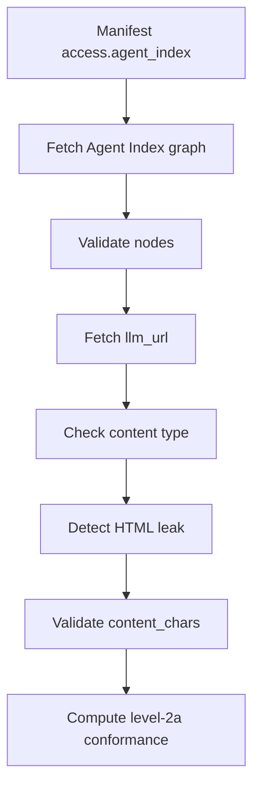

# Level 2a Agent Index

Level 2a extends Level 1 with an Agent Index graph. The graph lists clean,
AI-readable endpoints and declares the metadata needed to validate those
endpoints.


<div class="audio-explainer">
  <video controls playsinline style="width: 100%; height: auto; border-radius: 12px;" aria-label="Winning AI search with Agent View — audio explainer">
    <source src="/level-2a-agent-index-explained.mp4" type="video/mp4">
    Your browser does not support the video tag. Listen to the audio explainer: <a href="/Winning_AI_search_with_Agent_View.m4a">Winning_AI_search_with_Agent_View.m4a</a>.
  </video>
  <p class="audio-explainer-caption">🔊 Audio explainer — winning AI search with Agent View.</p>
</div>

<div class="illustration-note">
  <svg width="14" height="14" viewBox="0 0 24 24" fill="none" stroke="currentColor" stroke-width="2" stroke-linecap="round" stroke-linejoin="round" aria-hidden="true">
    <circle cx="12" cy="12" r="10"></circle>
    <line x1="12" y1="16" x2="12" y2="12"></line>
    <line x1="12" y1="8" x2="12.01" y2="8"></line>
  </svg>
  <span>Illustrative example — for visual reference only.</span>
</div>

>[!important]
>Level 2a Agent Index validation is available through `validateIndexAi()` and
the `index-ai` CLI.

## Level 2a scope

Level 2a validation currently covers:

- manifest `access.agent_index`
- Agent Index graph fetch
- graph JSON content-type check
- graph JSON parse check
- graph schema validation
- `nodes` array validation
- deprecated `pages` array failure
- `total_nodes` mismatch warning
- per-node `llm_url` structural validation
- per-node `llm_url` fetch
- clean endpoint content-type validation
- hard HTML leak failure
- soft inline HTML warning
- `content_chars` exact and max validation
- private `llm_url` host blocking by default
- heuristic security checks against fetched clean endpoint text
- Level 2a conformance computation

## Agent Index location

The AI Manifest declares the Agent Index with:

```txt
access.agent_index
```

When the manifest uses this value:

```txt
/agent-index.json
```

the validator resolves it against the target origin and fetches that graph.

`access.agent_index` is the manifest field name that points to the Agent Index
graph.

## Graph shape

The Agent Index must use a `nodes` array.

The deprecated `pages` array must fail.

Top-level graph fields include:

| Field | Required | Rule |
| --- | ---: | --- |
| `generated` | Yes | Non-empty string. |
| `spec_version` | Yes | Must be `"1.0"`. |
| `nodes` | Yes | Non-empty array. |
| `total_nodes` | No | Warns if it does not match `nodes.length`. |
| `pages` | No | Must not be present in any form (array, object, string, etc.) — the schema rejects any value assigned to this key. |

## Node required fields

Each node must include:

| Field | Required | Rule |
| --- | ---: | --- |
| `id` | Yes | Non-empty string. |
| `type` | Yes | Non-empty string. |
| `label` | Yes | Non-empty string. |
| `description` | Yes | Non-empty string. |
| `content` | Yes | Object with clean endpoint metadata. |
| `meta` | Yes | Object with freshness metadata. |

Each node `content` object must include:

| Field | Required | Rule |
| --- | ---: | --- |
| `llm_summary` | Yes | Non-empty string. |
| `llm_url` | Yes | HTTP URL or root-relative path after resolution. |
| `content_chars` | Yes | Integer greater than or equal to `1`. |
| `content_chars_mode` | Yes | `exact` or `max`. |
| `summary_method` | Yes | `manual`, `truncate`, or `llm`. |
| `language` | Yes | Non-empty string. |
| `content_sha256` | No | 64-character lowercase or uppercase hex string. Only checked when `content_chars_mode` is `exact`. |
| `content_version` | No | Any value. Warns if present and not a string. |

Each node `meta` object must include:

| Field | Required | Rule |
| --- | ---: | --- |
| `updated` | Yes | Non-empty string. |
| `refresh_frequency` | Yes | Non-empty string. |

## Clean endpoint rules

For each node, the validator resolves and fetches `content.llm_url`.

Private or local `llm_url` hosts fail by default. Use `allowPrivateHosts` only
for trusted local or private development targets.

The clean endpoint must be served as:

```txt
text/markdown
text/plain
```

Other content types fail the clean endpoint content-type check.

## HTML leak checks

Hard HTML leakage fails. Examples include document or layout tags such as:

```txt
<!doctype html>
<html>
<body>
<script>
<div>
<nav>
```

The detector ignores HTML-like examples inside Markdown code spans and fenced
code blocks.

Tolerated inline markup such as `<br>` is reported as a soft warning.

## content_chars rules

`content_chars` is measured from the fetched clean endpoint body.

| Mode | Rule |
| --- | --- |
| `exact` | The measured Unicode NFC code point count must equal `content_chars`. |
| `max` | The measured Unicode NFC code point count must be less than or equal to `content_chars`. |

`content_chars` must be an integer greater than or equal to `1`.

Emoji count as one code point. Decomposed accents are normalized with Unicode
NFC before counting.

## content_sha256 and content_version (optional)

`content_sha256` and `content_version` are both optional. An Agent Index that
omits them is still fully Level 2a conformant.

`content_sha256` turns a `content_chars` declaration into a verifiable
attestation: the exact content served, not just its length. It is only
meaningful — and only checked — when `content_chars_mode` is `exact`, since
`max` mode allows the served content to vary.

| Mode | Rule |
| --- | --- |
| `exact`, `content_sha256` present | The measured hash must equal the declared `content_sha256`, compared case-insensitively. Mismatch fails with `content drift — declared content_sha256 does not match content served at llm_url`. |
| `max`, `content_sha256` present | Ignored. Never computed or checked. |
| `content_sha256` absent | Ignored, in either mode. |

The measured hash is `sha256` of the same Unicode-NFC-normalized, UTF-8-encoded
text that `content_chars` counts — see [content_chars](/guide/content-chars)
for the normalization step. See
[Fix your report](/guide/fix-your-report#if-content_sha256-does-not-match) if
the validator reports this check.

`content_version` carries no cryptographic verification — it is an opaque,
free-form version label (a git hash, a tag, an ISO timestamp). The validator
only checks its type: present and not a string produces a warning.

## Validation flow



## Conformance result

`validateIndexAi()` can return:

```txt
level-2a
```

when Level 1 checks pass and the Level 2a Agent Index checks pass.

Warnings can still affect `passed` when `failOnWarn` or strict warning behavior
is enabled. See [Conformance vs Passed](/guide/conformance-vs-passed).

## Scope

Level 2a is the highest structural level the validator emits. For what it does
not implement, see [Scope](/guide/scope).
