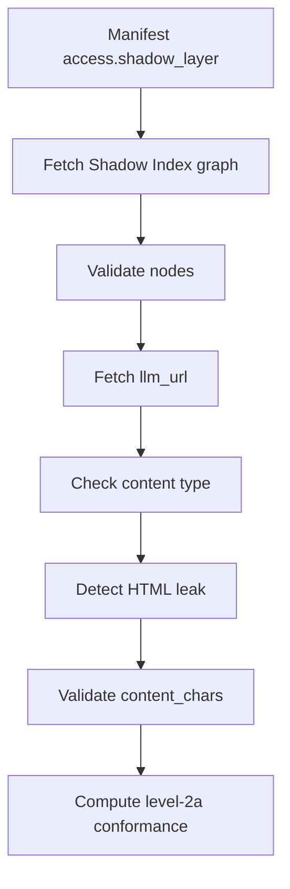

# Level 2a Shadow Index

Level 2a extends Level 1 with a Shadow Index graph. The graph lists clean,
AI-readable endpoints and declares the metadata needed to validate those
endpoints.

Level 2a Shadow Index validation is available through `validateIndexAi()` and
the `index-ai` CLI.

## Level 2a scope

Level 2a validation currently covers:

- manifest `access.shadow_layer`
- Shadow Index graph fetch
- graph JSON content-type check
- graph JSON parse check
- graph schema validation
- `nodes` array validation
- deprecated `pages` array failure
- `total_nodes` mismatch warning
- per-node `llm_url` structural validation
- per-node `llm_url` fetch
- clean endpoint content-type validation
- hard HTML leak failure
- soft inline HTML warning
- `content_chars` exact and max validation
- private `llm_url` host blocking by default
- heuristic security checks against fetched clean endpoint text
- Level 2a conformance computation

## Shadow Index location

The AI Manifest declares the Shadow Index with:

```txt
access.shadow_layer
```

When the manifest uses this value:

```txt
/ai-graph.json
```

the validator resolves it against the target origin and fetches that graph.

## Graph shape

The Shadow Index must use a `nodes` array.

The deprecated `pages` array must fail.

Top-level graph fields include:

| Field | Required | Rule |
| --- | ---: | --- |
| `generated` | Yes | Non-empty string. |
| `spec_version` | Yes | Must be `"1.0"`. |
| `nodes` | Yes | Non-empty array. |
| `total_nodes` | No | Warns if it does not match `nodes.length`. |
| `pages` | No | Must not be present as an array. |

## Node required fields

Each node must include:

| Field | Required | Rule |
| --- | ---: | --- |
| `id` | Yes | Non-empty string. |
| `type` | Yes | Non-empty string. |
| `label` | Yes | Non-empty string. |
| `description` | Yes | Non-empty string. |
| `content` | Yes | Object with clean endpoint metadata. |
| `meta` | Yes | Object with freshness metadata. |

Each node `content` object must include:

| Field | Required | Rule |
| --- | ---: | --- |
| `llm_summary` | Yes | Non-empty string. |
| `llm_url` | Yes | HTTP URL or root-relative path after resolution. |
| `content_chars` | Yes | Integer greater than or equal to `1`. |
| `content_chars_mode` | Yes | `exact` or `max`. |
| `summary_method` | Yes | `manual`, `truncate`, or `llm`. |
| `language` | Yes | Non-empty string. |

Each node `meta` object must include:

| Field | Required | Rule |
| --- | ---: | --- |
| `updated` | Yes | Non-empty string. |
| `refresh_frequency` | Yes | Non-empty string. |

## Clean endpoint rules

For each node, the validator resolves and fetches `content.llm_url`.

Private or local `llm_url` hosts fail by default. Use `allowPrivateHosts` only
for trusted local or private development targets.

The clean endpoint must be served as:

```txt
text/markdown
text/plain
```

Other content types fail the clean endpoint content-type check.

## HTML leak checks

Hard HTML leakage fails. Examples include document or layout tags such as:

```txt
<!doctype html>
<html>
<body>
<script>
<div>
<nav>
```

The detector ignores HTML-like examples inside Markdown code spans and fenced
code blocks.

Tolerated inline markup such as `<br>` is reported as a soft warning.

## content_chars rules

`content_chars` is measured from the fetched clean endpoint body.

| Mode | Rule |
| --- | --- |
| `exact` | The measured Unicode NFC code point count must equal `content_chars`. |
| `max` | The measured Unicode NFC code point count must be less than or equal to `content_chars`. |

`content_chars` must be an integer greater than or equal to `1`.

Emoji count as one code point. Decomposed accents are normalized with Unicode
NFC before counting.

## Validation flow



## Conformance result

`validateIndexAi()` can return:

```txt
level-2a
```

when Level 1 checks pass and the Level 2a Shadow Index checks pass.

Warnings can still affect `passed` when `failOnWarn` or strict warning behavior
is enabled. See [Conformance vs Passed](/guide/conformance-vs-passed).

## Scope

Level 2a is the highest structural level the validator emits. For what it does
not implement, see [Scope](/guide/scope).
