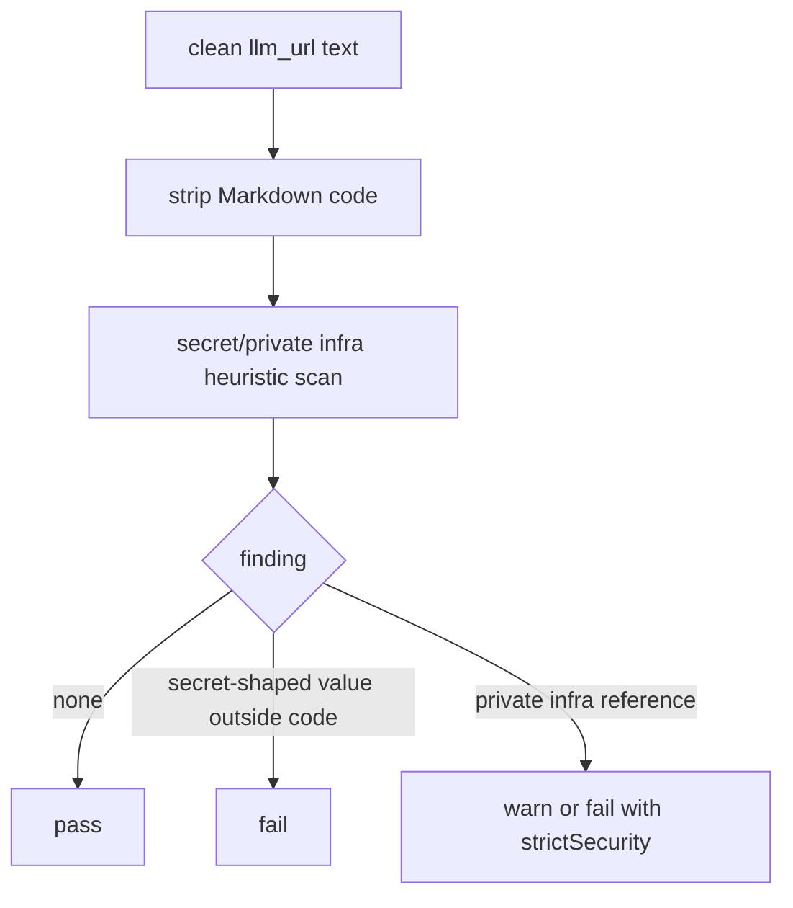

# Security Checks

Your AI-facing endpoints are public. Anything you leak there, an agent can read.
These checks catch the obvious leaks before that happens.

The validator runs conservative security checks through `validateIndexAi()` and
the `index-ai` CLI.

These checks are heuristic. They look for obvious public leak signals in
AI-facing clean endpoint text, but they are not a full security audit and they
are not vulnerability scanning.

## What is checked

The validator scans fetched Level 2a clean endpoint bodies from node
`content.llm_url` values.

Before fail-level secret and private infrastructure checks run, Markdown fenced
code and inline code are stripped. This lets documentation show examples without
turning every code sample into a finding.



## SEC_SECRET_PATTERN

`SEC_SECRET_PATTERN` detects obvious secret-shaped values in public AI-facing
content.

| Input pattern | Result |
| --- | --- |
| Secret-shaped value outside Markdown code | `fail` |
| Secret-shaped value only inside Markdown fenced or inline code | `pass` |
| Sensitive environment variable name only, such as `SUPABASE_SERVICE_ROLE_KEY` or `service_role_key` | `warn` |

When a secret-shaped value fails, evidence is redacted in check details. The
validator should not print the full secret value back to the user.

Sensitive environment variable names are treated as references, not leaked
secret values. They can still be noisy in public AI-facing content, so they are
reported as warnings.

## SEC_PRIVATE_INFRA_PATTERN

`SEC_PRIVATE_INFRA_PATTERN` detects obvious private or internal infrastructure
references in public AI-facing content.

Examples include private IPv4 ranges, localhost references, and hostnames such
as `.internal`, `.local`, or `.lan`.

By default, these findings are warnings:

```txt
SEC_PRIVATE_INFRA_PATTERN -> warn
```

With `strictSecurity: true`, they become failures:

```txt
SEC_PRIVATE_INFRA_PATTERN -> fail
```

Markdown code examples are ignored before this heuristic runs.

## Private llm_url Hosts

Private `content.llm_url` hosts fail by default because a validator that fetches
URLs from a public graph should not become a private-network probing helper.

Use `allowPrivateHosts: true` only for trusted local or private development:

```ts
const result = await validateIndexAi({
  target: 'http://localhost:3000',
  strict: false,
  strictSecurity: false,
  failOnWarn: false,
  verbose: false,
  timeoutMs: 10000,
  maxConcurrency: 5,
  allowPrivateHosts: true,
})
```

This is a development exception. It should not be used as evidence that private
endpoints are appropriate for public `index-ai` implementations.

## Verdict Interaction

Security checks do not change structural `conformance`.

They can change `passed`:

- `SEC_SECRET_PATTERN` failures make `passed` false.
- `SEC_PRIVATE_INFRA_PATTERN` warnings do not fail by default.
- `strictSecurity` upgrades private infrastructure warnings to failures.
- `failOnWarn` makes any warning fail `passed`.
- `strict` makes SHOULD-level warnings fail `passed`.

## Scope

These are conservative heuristics, not a security guarantee. The package does
not prove that a site is safe, and does not perform a full security audit,
vulnerability scanning, penetration testing, privacy review, or legal review.
See [Scope](/guide/scope).
