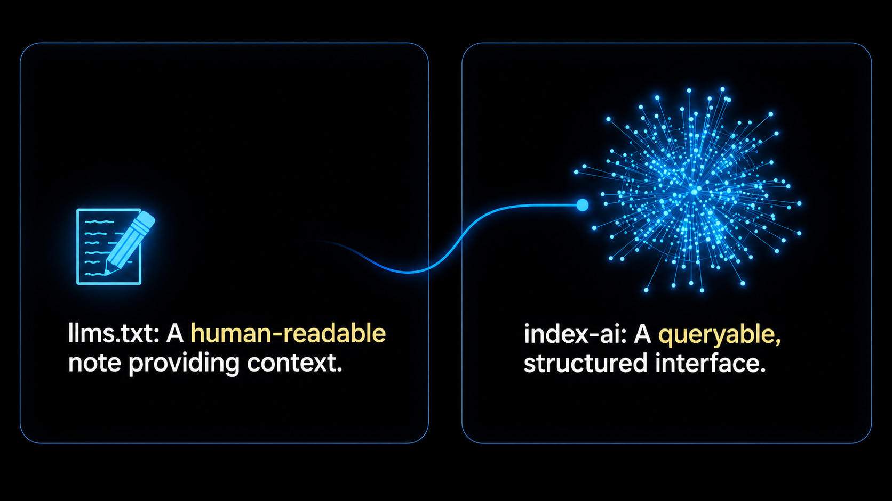

<br>

<div class="hero-media">
  <video src="/clean_Agent_View__The_Machine-Readable_Layer.mp4" controls autoplay muted loop playsinline style="width: 100%; height: auto; border-radius: 12px;" aria-label="index-ai-validator: from a public website through the AI Manifest, Agent Index, and clean endpoints to a validation result">
    Your browser does not support the video tag. The index-ai-validator demo shows a public website validated through the AI Manifest, Agent Index, and clean endpoints to a validation result.
  </video>
</div>

## What is index-ai-validator?

`@hardmachinelabs/index-ai-validator` checks whether your site correctly
implements the open [`index-ai` specification](https://github.com/jordachmakaya/index-ai) —
the machine-readable layer that tells AI agents what your site actually
says, instead of leaving them to guess from rendered HTML.

It is a free CLI that checks two things:

1. **Is a site's `index-ai` layer already implemented correctly?**
   Default validation mode — local, no signup, no account. Available now.
2. **How AI-ready is a site overall, implemented or not?**
   `scan` (coming soon) — will call the remote Agent View scanner, return
   a score, a verdict, and findings, once the agent-view.com service is
   publicly available.

Run Default validation mode against a real site in one command.

## What is Agent View?



If `llms.txt` is a human-readable note, `index-ai` is a queryable,
structured interface.

Most sites are built for browsers: HTML, CSS, and JavaScript. AI agents
read that same page differently — they need a clean, machine-readable
interface that states what a site is, where its content lives, how fresh
it is, and how much text they will pay tokens for before fetching it.
Agent View is that interface: an [AI Manifest](/guide/level-1-manifest),
an [Agent Index](/guide/level-2a-agent-index), and clean content
endpoints that return Markdown or plain text instead of rendered HTML.
It is defined by the open [`index-ai` specification](https://github.com/jordachmakaya/index-ai)
and diagnosed at scale by [Agent View](https://agent-view.com), the
remote scanner `scan` calls.

## See it for yourself

[Jordach's own site](https://jordach.dev) implements Agent View — proof,
not a claim to take on faith. Try this:

1. Copy `https://jordach.dev`.
2. Paste it into any LLM chat (ChatGPT, Claude, or similar) and ask it
   questions about Jordach — his background, his work, his projects.
3. Then ask the LLM directly: was that information easy to retrieve, and
   why?

Easy or hard, and why, is exactly what this CLI measures. Run Default
validation mode on your own site next (`scan` is coming soon).

## Run it

```bash
npx @hardmachinelabs/index-ai-validator https://example.com
```

> [!warning]
> `scan` is not yet publicly available. It depends on the agent-view.com
> service, which has not launched yet. See [the CLI reference](/guide/cli#scan)
> for updates.

```bash
npx @hardmachinelabs/index-ai-validator scan https://example.com   # coming soon
```

Once available, `scan` will return an AI-readiness score out of 100,
findings, and an optional shareable HTML report — no implementation
required first.

The package name is `@hardmachinelabs/index-ai-validator`. Its CLI binary is installed under two equivalent names, `index-ai` and `index-ai-validator` — either one runs the same executable. Default validation mode runs automatically — there is no command keyword to type. By default it prints a deterministic, summary-first report:

```txt
index-ai validation result

Target: https://example.com
Duration: 42 ms
Conformance: level-2a
Passed: true

Requested target level: Level 2a
Tested levels: Level 1, Level 2a
Achieved level: Level 2a

Level results:
- Level 1: 22 pass, 0 warn, 0 fail
- Level 2a: 37 pass, 0 warn, 0 fail

Summary:
- pass: 59
- warn: 0
- fail: 0
- total: 59

Metrics:
- manifest_found: true
- agent_index_found: true
- total_nodes: 6
- valid_clean_endpoints: 6
- valid_content_chars: 6

No failures or warnings.

Next:
- No blocking validation fixes were found.
```

Both commands accept `--json` for a stable machine-readable result, and `--html` for a shareable HTML report. Default validation mode's `--json` output includes:

- `schema_version`
- `target`
- `generated_at`
- `duration_ms`
- `conformance`
- `passed`
- `summary`
- `metrics`
- `checks`
- `requested_level`
- `tested_levels`
- `achieved_level`
- `failed_level`
- `level_results`

See [JSON Output](/guide/json-output) for field meanings and shapes.

Default validation mode checks Level 1 + Level 2a conformance today. `scan` (coming soon) will call the remote Agent View scanner for a broader AI-readiness diagnostic. Neither is certification, and neither is a traffic promise. → [See the full scope](/guide/scope)

## What Default validation mode checks

- Level 1 AI Manifest: fetch, JSON content type, JSON parse, and schema shape
- The `access.agent_index` declaration and the Agent Index graph it points to
- Level 2a node fields, `llm_url` structure, and clean endpoint content types
- Hard HTML leaks, with tolerated soft inline markup reported as warnings
- `content_chars` in `exact` and `max` modes, using Unicode NFC code-point counting
- Secret-shaped values and private infrastructure references in public AI-facing content
- Discovery hints on the homepage, `robots.txt`, and `/llms.txt`

## What `scan` will check (coming soon)

- Five scored dimensions from the remote Agent View scanner: `access`, `extractability`, `citability`, `safety`, and `agent_layer`
- The gap between what a human sees (rendered page) and what a bot can extract (raw content)
- Findings ranked by severity, with fix links back to `index-ai` where relevant

For what each command deliberately does not do, see [Scope](/guide/scope).

<div class="cta-band">
  <div class="cta-copy">
    <strong>Free tool. Need the layer built for you?</strong>
    <span>Get your agent-facing layer reviewed and shipped by the maker of index-ai.</span>
  </div>
  <div class="cta-actions">
    <a class="primary" href="https://jordach.dev/services/ai-readable-website-audit">AI-readable audit</a>
    <a class="secondary" href="https://jordach.dev/contact">Contact</a>
  </div>
</div>
